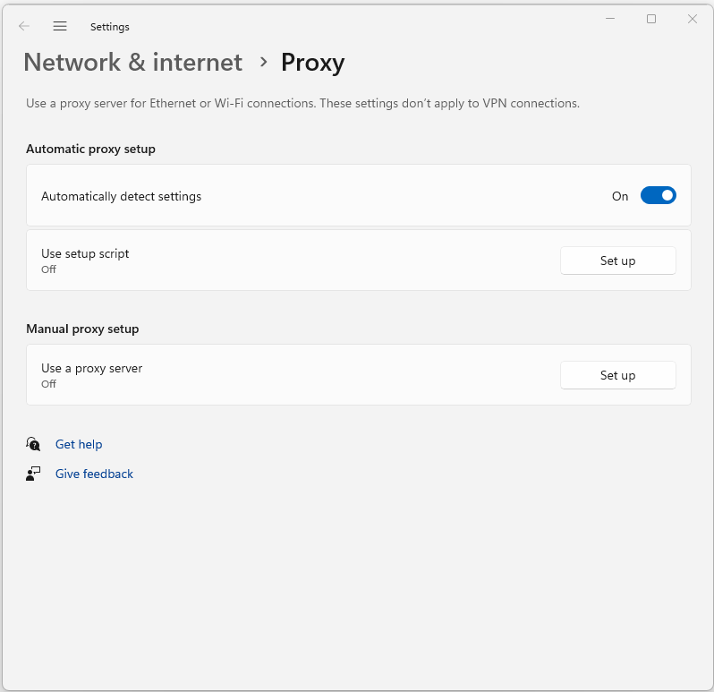

:orphan:
(windows-proxy-settings)=

# Proxy Settings in Windows

Proxy settings play a crucial role in facilitating network communication between a computer and the internet. They serve as intermediaries that handle requests and responses, enhancing security, performance, and privacy. In the context of Windows operating systems, proxy settings can be configured to enable seamless internet connectivity and manage network traffic efficiently. In this article, we will delve into the fundamentals of proxy settings in Windows, their significance, and how to configure them effectively.

## Understanding Proxies

A proxy, in the realm of computer networks, acts as an intermediary between a user's device and the internet. It acts as a gateway that forwards requests and responses between the user and web servers. Proxies can be employed for various purposes, including enhancing security, improving network performance, filtering content, and maintaining privacy.

 

## Why Proxy Settings Matter

Proxy settings are essential as they provide users with control over how their computer interacts with the internet. These settings can influence the browsing experience, access to certain websites, and network security. By directing traffic through a proxy server, users can achieve several benefits:

- **Anonymity and Privacy:** Proxy servers can mask a user's IP address, making their online activities more private and preventing websites from tracking them. This can be particularly useful when accessing websites from public networks or locations where anonymity is desired.

- **Content Filtering:** Organizations and institutions often use proxy servers to implement content filtering. This allows them to restrict access to specific websites or types of content, ensuring compliance with company policies or regulatory requirements.

- **Improved Performance:** Proxy servers can cache frequently requested web content. When multiple users access the same content, the proxy can deliver it from its cache, reducing the load on the internet connection and improving overall network performance.

- **Security:** Proxies can act as a buffer between a user's device and the internet, providing an additional layer of security. They can block malicious websites, filter out potentially harmful content, and prevent direct connections to the user's device.

## Configuring Proxy Settings in Windows

Configuring proxy settings in Windows is a straightforward process that involves specifying the proxy server details in the operating system. Here's how you can do it:

### Using the Settings App

1. Open the **Settings** app by clicking on the Start menu and selecting **Settings** (the gear icon).
2. Navigate to the **Network & Internet** section.
3. In the left sidebar, click on **Proxy**.
4. In the right pane, you will find the **Manual proxy setup** section. Here, you can toggle the switch to enable manual proxy configuration.
5. Enter the **Address** and **Port** of the proxy server you want to use.
6. If the proxy server requires authentication, you can also enter your credentials by toggling the switch for **Use a proxy server** and entering the appropriate information.
7. Once you've entered the necessary details, close the Settings app. Your proxy settings will now be applied.

### Using Internet Properties

1. Press the **Win + R** keys to open the Run dialog box.
2. Type **inetcpl.cpl** and press **Enter**. This will open the **Internet Properties** window.
3. Go to the **Connections** tab and click on the **LAN settings** button.
4. In the **Local Area Network (LAN) Settings** window, check the box labeled **Use a proxy server for your LAN**.
5. Enter the **Address** and **Port** of the proxy server.
6. If the proxy server requires authentication, click on the **Advanced** button and enter your credentials.
7. Click **OK** to save the settings and close the windows.

## Types of Proxy Settings

There are different types of proxy settings that you can configure in Windows, depending on your requirements:

- **HTTP Proxy:** An HTTP proxy is designed to handle web traffic. It is commonly used to speed up web browsing by caching web pages and delivering them to users from the cache. HTTP proxies can also be used to filter content and control access to specific websites.

- **HTTPS Proxy:** Similar to an HTTP proxy, an HTTPS proxy focuses on securing web traffic. It is particularly useful when you want to encrypt the data transmitted between your device and the proxy server, ensuring the confidentiality of your online activities.

- **SOCKS Proxy:** A SOCKS (Socket Secure) proxy is a versatile proxy protocol that can handle various types of traffic, including web traffic, email, and even torrent downloads. It operates at a lower level than HTTP and HTTPS proxies, making it suitable for applications that don't support proxy settings natively.

- **FTP Proxy:** An FTP (File Transfer Protocol) proxy is tailored for transferring files between a client and a server using the FTP protocol. It can manage the file transfer process, enhancing security and performance.

## Importance of Proxy Settings

Proxy settings hold significant importance in both personal and professional computing environments. Let's explore their relevance in various scenarios:

- **Corporate Networks:** In a corporate setting, proxy servers are often used to regulate internet usage and enforce security policies. By routing all internet traffic through a proxy server, the organization can monitor and control access to websites, ensuring that employees adhere to acceptable usage policies. Additionally, proxy servers can cache frequently accessed resources, reducing bandwidth usage and improving browsing speed.

- **Privacy and Anonymity:** Individuals who are concerned about their online privacy can benefit from proxy settings. By using a proxy server, users can hide their IP address, making it difficult for websites to track their online activities. This is particularly useful when using public Wi-Fi networks or when accessing websites that may be blocked in certain regions.

- **Access to Restricted Content:** Proxy settings can enable users to access geo-restricted content or websites that are blocked in their region. By connecting to a proxy server located in a different country, users can appear as if they are browsing from that country, thereby bypassing regional restrictions.

- **Enhanced Security:** Proxy servers act as intermediaries between users and the internet, acting as a barrier against potential security threats. They can block access to malicious websites, prevent direct connections to users' devices, and provide an additional layer of security by masking the user's IP address.

- **Bandwidth Optimization:** Proxy servers can optimize bandwidth usage by caching web content. When multiple users access the same content, the proxy server can deliver it from its cache, reducing the need to fetch the content from the internet. This results in faster load times and reduced strain on the network.

## Final Words

In the realm of computer networks and internet connectivity, proxy settings are a fundamental aspect of configuring how devices interact with the online world. By acting as intermediaries, proxy servers offer benefits ranging from enhanced security and privacy to improved performance and access to restricted content. Understanding the types of proxy servers and how to configure proxy settings in Windows empowers users to tailor their online experiences according to their needs. Whether it's ensuring secure corporate network communication or maintaining personal privacy, proxy settings play a pivotal role in shaping modern internet usage.