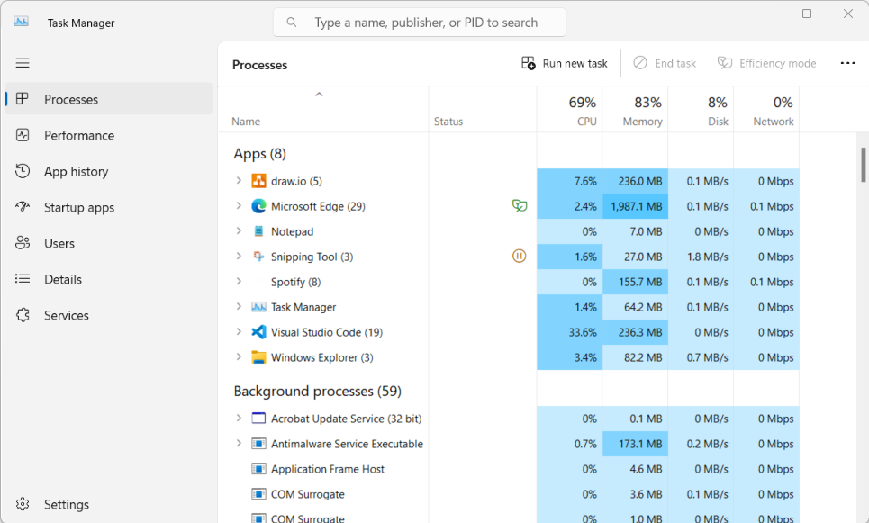
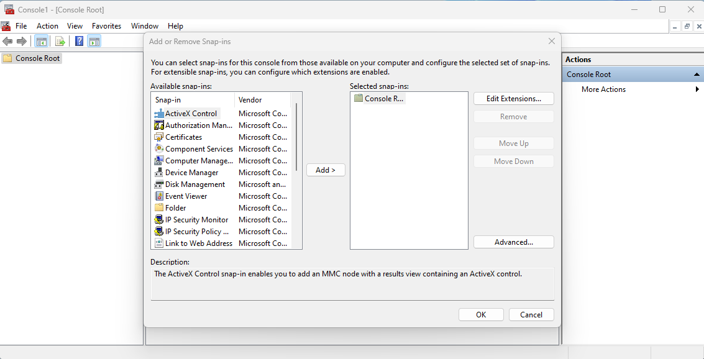
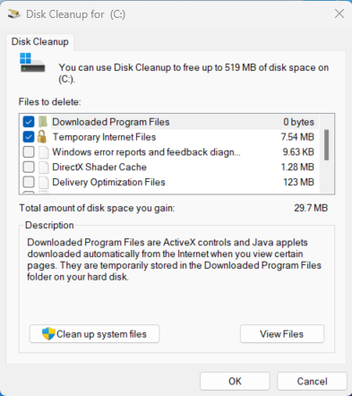
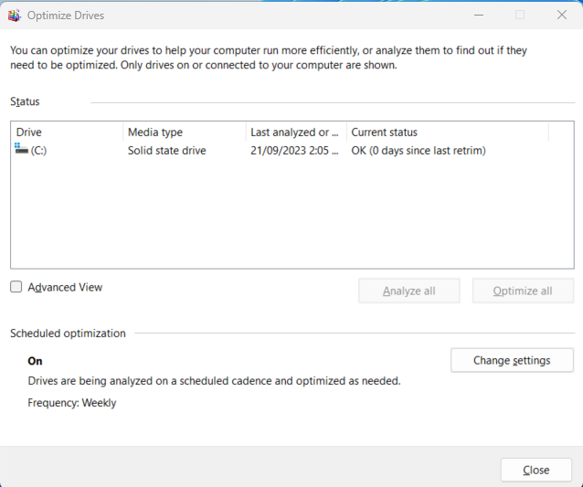
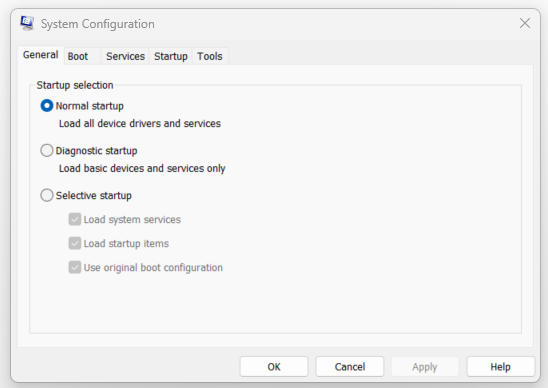
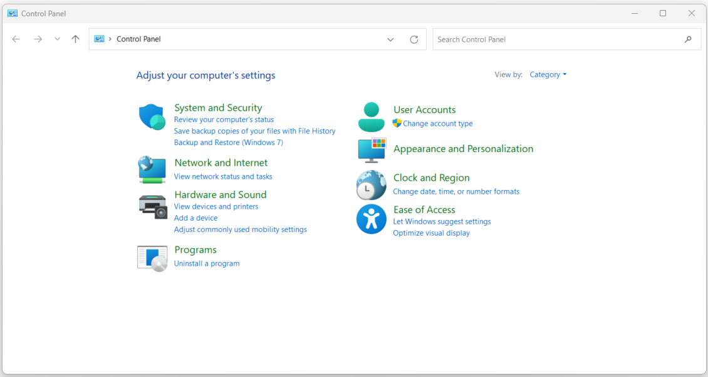
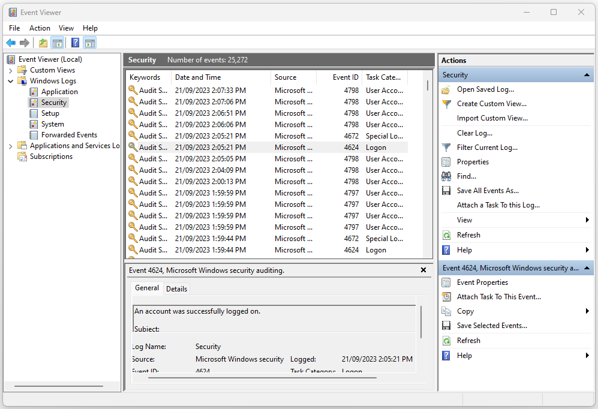
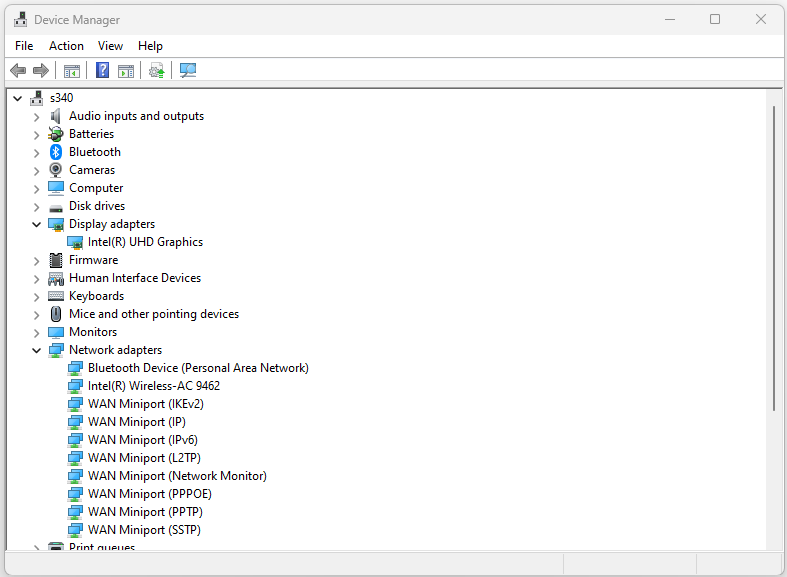

:orphan:
(windows-tools)=

# Windows OS Tools and Features

In the realm of operating systems, Windows offers a plethora of tools to help users manage and optimize their systems efficiently. These tools range from system monitoring to configuration management, all contributing to a smooth and streamlined user experience. In this article, we will delve into the functionalities, features, use cases, and examples of some essential Windows OS tools.

## Task Manager

The **Windows Task Manager** is a crucial built-in utility in the Windows operating system that offers users the ability to monitor, manage, and troubleshoot various aspects of their computer's performance and processes. It provides a comprehensive view of the system's resources and running applications, allowing users to identify and resolve performance issues, terminate unresponsive programs, and gain insights into the overall health of their system.

 

### Purpose and Functionality

The primary purpose of the Windows Task Manager is to provide users with a real-time snapshot of their computer's performance and running processes. It serves as a diagnostic tool that aids in understanding how system resources are being utilized and helps users pinpoint any resource bottlenecks or application-related problems. Task Manager is particularly valuable in scenarios where a computer is running slow, freezing, or experiencing other performance-related issues.

### Accessing the Task Manager

To access the Windows Task Manager, users can utilize several methods:

- **Ctrl + Shift + Esc**: This keyboard shortcut directly opens the Task Manager.
- **Ctrl + Alt + Delete**: After pressing these keys, users can select "Task Manager" from the options menu that appears.
-3. **Right-Click the Taskbar**: Right-clicking on the taskbar and selecting "Task Manager" opens the utility.

### Key Tabs and Functionality

The Task Manager consists of several tabs, each providing unique insights into different aspects of system performance:

- **Processes Tab**

    The Processes tab displays a list of all currently running applications and background processes. It provides information about the CPU, Memory, Disk, Network, and GPU usage for each process. This tab is particularly useful for identifying resource-intensive applications and for terminating unresponsive programs.

    **Example**: If a web browser is consuming an unusually high amount of memory, it could indicate a memory leak or a problematic website. Users can use the Task Manager to terminate the browser and free up resources.

- **Performance Tab**

    The Performance tab offers a visual representation of system performance metrics, including CPU, Memory, Disk, Ethernet, and GPU usage. This tab is valuable for monitoring resource utilization trends over time.

    **Example**: If the CPU usage graph consistently spikes to 100% and stays there, it might indicate that a specific application is causing excessive CPU load, impacting overall system performance.

- **App History Tab**

    The App History tab provides historical resource usage data for Windows Store apps. It helps users track resource consumption patterns over time.

    **Example**: If a user is concerned about the data usage of a particular app, they can use this tab to understand how much data the app has consumed over the past weeks or months.

- **Startup Tab**

    The Startup tab lists the applications and processes configured to launch automatically when the computer starts. Users can enable or disable startup items to optimize boot times and system performance.

    **Example**: If a computer takes a long time to start up, users can review the Startup tab to identify and disable unnecessary startup programs that might be contributing to the delay.

- **Users Tab**

    The Users tab displays a list of all logged-in users and the processes associated with each user account. It helps in identifying resource usage on a per-user basis.

    **Example**: If a computer is running slowly while multiple users are logged in, the Users tab can show which user's processes are consuming the most resources, allowing for better resource management.

- **Details Tab**

    The Details tab provides a more comprehensive view of running processes compared to the Processes tab. It includes additional information such as the process's status, description, company name, and more.

    **Example**: If a user wants to identify a specific instance of a browser process among several running instances, the Details tab can help by providing detailed information about each process.

- **Services Tab**

    The Services tab lists the background services running on the system. Users can start, stop, and restart services from this tab.

    **Example**: If a user is troubleshooting network connectivity issues, they might need to restart the networking-related services. The Services tab enables them to do so efficiently.

### Additional Features

In addition to the basic tabs and functionalities, the Windows Task Manager also offers below features:

- **Resource Monitor** 

    Accessible from the Performance tab, the **Resource Monitor** provides in-depth information about resource usage, including detailed graphs and statistics for CPU, Memory, Disk, and Network.

    **Example**: If a user wants to understand which specific files are causing high disk usage, the Resource Monitor can provide detailed insights into file-related operations.

- **End Task and End Process**

    From the Processes tab, users can right-click on a specific process and choose to **End Task** or **End Process**. End Task attempts to gracefully close the application, while End Process forcefully terminates it.

    **Example**: If a program becomes unresponsive and is not closing through normal means, users can use the Task Manager to forcefully terminate the application.

- **Open File Location**

    In the Details tab, users can right-click on a process and select **Open File Location**. This opens the directory where the executable file for that process is located.

    **Example**: If a user is unfamiliar with a particular process and wants to investigate its origin, the Open File Location feature can provide insights into its source.

- **Creating Dump Files**

    Task Manager can generate memory dump files of a running process. These files are valuable for diagnosing application crashes and system errors. This feature is particularly useful for developers and IT professionals who need to analyze the root cause of issues.

    **Example:** Imagine you are using a video editing software, and it suddenly becomes unresponsive. You suspect that the software might have encountered a critical error. You can use Windows Task Manager to create a memory dump file for the unresponsive software. This memory dump file can be shared with technical support or analyzed using debugging tools to identify the cause of the crash.

## Microsoft Management Console (MMC)

The **Microsoft Management Console (MMC)** is a powerful and versatile tool that provides a graphical user interface (GUI) for managing and configuring various aspects of a Windows operating system and its associated components. It serves as a centralized platform for organizing and presenting administrative tools and snap-ins, allowing system administrators and advanced users to efficiently perform various system-related tasks. In this article, we will delve into the key features, components, and benefits of the Microsoft Management Console.

 

### Key Features and Components 

- **Snap-ins**

    At the heart of the Microsoft Management Console are **snap-ins**, which are modular tools or extensions that provide specific management capabilities. Snap-ins offer a way to manage various aspects of the operating system, applications, and network services in a unified interface. Each snap-in focuses on a particular area of administration, such as user accounts, disk management, device configuration, event logs, and more.

    For example, the "Computer Management" snap-in combines several sub-snap-ins, including "Device Manager," "Disk Management," "Event Viewer," and "Local Users and Groups." This consolidation of tools within a single interface enhances administrative efficiency by reducing the need to open multiple standalone applications.

- **Console Files**

    MMC allows users to create and save customized **console files** that store the arrangement and configuration of snap-ins. These console files have the extension ".msc" and enable administrators to create specific toolsets tailored to their needs. By creating console files, users can quickly access the necessary snap-ins without having to manually navigate through various menus each time.

    For instance, a network administrator could create a custom console file containing snap-ins for "Active Directory Users and Computers," "DNS Manager," and "Group Policy Management," simplifying the process of managing network resources.

- **Predefined Consoles**

    MMC offers a set of **predefined consoles** that are readily available for specific administrative tasks. These predefined consoles come with a selection of snap-ins already configured to streamline common management activities.

    An example of a predefined console is the "Computer Management" console, which provides a consolidated view of various system management tools. Similarly, the "Services" console focuses on managing Windows services, and the "Event Viewer" console is designed for viewing and analyzing system event logs.

- **Author Mode and User Mode**

    MMC operates in two distinct modes: **Author Mode** and **User Mode**.

    - **Author Mode:** In this mode, administrators can create, customize, and save console files by adding and arranging snap-ins. Author Mode is used to design tailored management interfaces for specific tasks.

    - **User Mode:** In User Mode, individuals can open console files created in Author Mode. However, they cannot modify the console layout or add/remove snap-ins. This mode is intended for those who need access to specific administrative tools without altering the console's configuration.

### Benefits and Importance

The Microsoft Management Console plays a pivotal role in enhancing system administration and management in various ways:

- **Centralized Management Interface**

    One of the primary advantages of MMC is its ability to provide a unified and organized interface for managing diverse system components. Instead of juggling multiple standalone tools, administrators can access various snap-ins within a single window. For instance, the "Computer Management" snap-in allows administrators to handle tasks related to hardware, storage, event logs, and user accounts all from one location.

- **Efficiency and Productivity**

    By offering a customizable interface through console files, MMC significantly improves administrative efficiency. Administrators can create console files that focus exclusively on the tools and snap-ins relevant to their responsibilities. This targeted approach reduces the time spent navigating through menus and searching for specific tools, thus boosting productivity.

- **Simplified Troubleshooting**

    MMC's integration of diverse snap-ins simplifies troubleshooting processes. Administrators can quickly move between different tools to gather information, diagnose issues, and implement solutions. For example, if a system error occurs, an administrator can use the "Event Viewer" snap-in to analyze relevant event logs and then proceed to the "Device Manager" snap-in to address any hardware-related problems.

- **Consistency in Administration**

    MMC ensures consistency in administrative tasks by offering a standardized interface for various system management operations. This consistency is especially valuable in enterprise environments where multiple administrators might need to perform similar tasks. Standardized console files prevent variations in configuration and ensure that critical management procedures are carried out correctly.

- **Reduced Learning Curve**

    With MMC, administrators do not need to learn the   intricacies of numerous separate tools. Instead, they can familiarize themselves with the MMC interface and its navigation, making it easier to adapt to new management tasks. As a result, the learning curve for mastering different management tools is substantially reduced.

- **Granular Access Control**

    MMC supports granular access control through its user mode and custom console files. Administrators can create console files tailored to specific user roles, granting them access only to the necessary snap-ins. This level of access control enhances security by limiting users to relevant administrative functions.

- **Third-Party Integration**

    Apart from Microsoft's built-in snap-ins, third-party applications and services can also provide their own snap-ins for MMC integration. This capability extends MMC's functionality to manage non-Microsoft components, making it a versatile tool for heterogeneous environments.

### Typical Usage and Use Cases

The Microsoft Management Console (MMC) serves as a versatile tool that finds application in various system administration scenarios. Its modular nature and consolidated interface make it valuable for addressing a wide range of tasks. Below are some typical usage scenarios and use cases for MMC:

 1. **User Account Management**

    MMC is commonly employed for managing user accounts in Windows environments. System administrators can utilize the "Local Users and Groups" snap-in to create, modify, and delete user accounts and groups. This use case is particularly important in organizations with a large user base, where efficient user management is essential for maintaining security and access control.

2. **Disk Management and Storage**

    Another key use case for MMC is disk management and storage configuration. The "Disk Management" snap-in allows administrators to create partitions, format drives, assign drive letters, and manage storage volumes. This functionality is crucial for optimizing disk usage, ensuring data availability, and addressing storage-related issues.

3. **Event Log Analysis and Troubleshooting**

    MMC's "Event Viewer" snap-in is widely used for analyzing system events and logs. Administrators can monitor application, security, and system events to identify issues, errors, and security breaches. This use case is vital for proactive troubleshooting, identifying patterns of system behavior, and responding to critical events promptly.

4. **Network Configuration and Monitoring**

    MMC plays a significant role in network administration. The "Network Connections" snap-in enables administrators to manage network interfaces, configure IP settings, and troubleshoot network connectivity. Additionally, MMC's integration with the "Device Manager" snap-in aids in configuring and diagnosing network devices.

5. **Group Policy Management**

    Group Policy management is a crucial aspect of Windows administration, and MMC simplifies this task through the "Group Policy Management" snap-in. Administrators can create and enforce policies that regulate user access, security settings, software deployment, and more. This use case ensures uniformity in system configurations across an organization.

6. **Services and Application Management**

    MMC's "Services" snap-in allows administrators to manage Windows services, controlling which services start automatically, manually, or are disabled. This feature is valuable for optimizing system performance, managing third-party applications, and troubleshooting issues related to specific services.

7. **Active Directory Administration**

    In enterprise environments, MMC is extensively used for Active Directory administration. The "Active Directory Users and Computers" snap-in enables administrators to manage user accounts, groups, organizational units, and group policies within the Active Directory domain. This use case is crucial for maintaining a structured and secure network environment.

8. **Security and Permissions Management**

    MMC aids administrators in managing security settings and permissions across the system. The "Local Security Policy" snap-in allows for configuring account policies, audit policies, and user rights assignments. This use case is pivotal for ensuring data security, compliance, and access control.

9. **Remote Server Administration**

    MMC can also be employed for remote server administration. By using the "Server Manager" snap-in, administrators can remotely manage multiple servers, monitor server health, and install roles and features. This feature streamlines server management in distributed environments.

10. **Printer and Print Queue Management**

    For managing printers and print queues, the "Print Management" snap-in within MMC is utilized. Administrators can monitor print jobs, manage print queues, and configure printer properties. This use case helps in ensuring efficient printer utilization and resolving printing-related issues.

## Additional Tools

### Disk Cleanup

Disk Cleanup is a utility that helps users reclaim storage space by removing unnecessary files from their hard drives.

 

**Features:**
- **Temporary Files Removal:** Disk Cleanup targets temporary files, system caches, and other files that are no longer needed.
- **File Compression:** It can compress old files to save space, making them take up less room on the hard drive.
- **Windows Update Cleanup:** Disk Cleanup can remove older versions of Windows updates to free up space.

**Use Cases:**
- **Freeing Up Space:** When your hard drive is running out of space, Disk Cleanup can identify and remove files that are no longer needed, such as temporary files and system caches.
- **Improving Performance:** By clearing unnecessary files, you can potentially improve system performance and responsiveness.
- **Maintenance:** Regularly using Disk Cleanup helps prevent storage-related issues and keeps your system running smoothly.

**Example:**
After using your computer for a while, you may notice that your hard drive's free space has significantly decreased. Running Disk Cleanup can help you identify and remove junk files, such as temporary internet files and system-generated cache, thus freeing up space on your hard drive.

### Disk Defragmenter

Disk Defragmenter is a tool that reorganizes the data on your hard drive to improve file access times and system performance.

 

**Features:**
- **Data Optimization:** Disk Defragmenter rearranges fragmented files on the hard drive to reduce the time it takes to read and write data.
- **Consolidation:** It consolidates free space on the drive, reducing fragmentation and improving overall storage efficiency.

**Use Cases:**
- **Performance Improvement:** Running Disk Defragmenter can lead to faster file access times, especially on traditional hard drives.
- **Preventive Maintenance:** Regular defragmentation can help prevent excessive fragmentation and maintain consistent system performance.
- **Storage Optimization:** By consolidating free space, Disk Defragmenter can ensure efficient use of your hard drive's capacity.

**Example:**
Over time, as you create, modify, and delete files, your hard drive can become fragmented, causing slower file access times. By running Disk Defragmenter, you can optimize the arrangement of files, leading to improved overall system performance.

### System Configuration

System Configuration (msconfig) is a tool that allows users to configure various startup and system settings.

 

**Features:**
- **Startup Configuration:** msconfig lets you control which programs and services launch during system startup.
- **Boot Options:** You can modify boot options, such as Safe Mode and debugging settings.
- **System Services:** msconfig provides the ability to enable or disable individual system services.

**Use Cases:**
- **Startup Troubleshooting:** Use msconfig to diagnose startup-related issues by selectively disabling startup programs.
- **Performance Optimization:** Disabling unnecessary startup programs can lead to faster system boot times and improved overall performance.
- **Diagnostic Configuration:** msconfig allows you to configure boot options that aid in diagnosing system problems.

**Example:**
If your computer takes a long time to start up, you can use msconfig to disable non-essential startup programs. By doing so, you can potentially reduce startup time and pinpoint any problematic applications causing delays.

### Control Panel

The Control Panel is a centralized hub for accessing various system settings and configurations.

 

**Features:**
- **System Settings:** Control Panel provides access to a wide range of system settings, including display, sound, network, and power options.
- **Program Management:** You can install, uninstall, and manage software and hardware components using Control Panel.
- **User Accounts:** Control Panel allows you to manage user accounts, passwords, and account types.

**Use Cases:**
- **Customization:** Use Control Panel to personalize system settings, such as display resolution, sound preferences, and desktop backgrounds.
- **Software Management:** Install, uninstall, or update software and hardware drivers through the Control Panel.
- **User Management:** Control Panel lets you manage user accounts, which is particularly useful on shared or family computers.

**Example:**
If you want to change your desktop wallpaper, adjust screen brightness, or uninstall a program, you can access these options through the Control Panel. This centralized interface simplifies the process of adjusting various system settings.

### Event Viewer

Event Viewer is a tool that allows users to view and analyze logs of system events and errors.

 

**Features:**
- **Log Viewing:** Event Viewer displays logs related to

 system, application, and security events.
- **Event Details:** It provides detailed information about each event, including timestamps, event IDs, and descriptions.
- **Filtering and Searching:** You can filter events based on various criteria and search for specific events.

**Use Cases:**
- **Troubleshooting:** Event Viewer helps identify and diagnose system errors, application crashes, and security breaches.
- **Performance Analysis:** Analyze event logs to identify patterns or events that may be affecting system performance.
- **System Monitoring:** Monitor events related to hardware changes, software installations, and user activities.

**Example:**
If you encounter a Blue Screen of Death (BSOD), you can use Event Viewer to examine the system logs related to the crash. Event Viewer will provide information about the error, helping you pinpoint the cause of the issue.

### Device Manager

Device Manager is a tool that allows users to manage hardware devices connected to their computer.

 

**Features:**
- **Device Status:** Device Manager displays the status of hardware devices, indicating whether they are working properly or encountering issues.
- **Driver Management:** You can update, roll back, uninstall, and disable device drivers through Device Manager.
- **Hardware Information:** Device Manager provides information about hardware components, such as processor, graphics card, and network adapter.

**Use Cases:**
- **Driver Issues:** Device Manager is used to resolve driver-related problems by updating or reinstalling drivers.
- **Device Configuration:** Configure hardware settings, such as enabling/disabling devices or adjusting driver settings.
- **Hardware Information:** Device Manager provides insights into the hardware components installed on your computer.

**Example:**
If your printer stops working, you can open Device Manager to check its status. If there's an issue with the printer driver, you can update or reinstall it through Device Manager, potentially resolving the problem.

## Final Words

In the world of Windows operating systems, these tools play a crucial role in managing, optimizing, and troubleshooting various aspects of your computer. These tools collectively contribute to a smoother user experience and improved system performance.

As technology continues to evolve, these tools may see enhancements and improvements, but their fundamental roles in system management and optimization will likely remain essential. So, whether you're troubleshooting a problem, optimizing performance, or just exploring your system's capabilities, these Windows OS tools are there to assist you every step of the way.