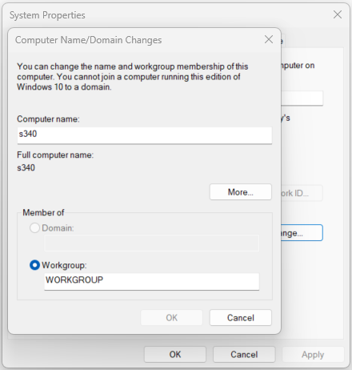

:orphan:
(workgroup-vs-domain)=

# Workgroup vs. Domain Setup

When it comes to networking and organizing computers within an organization, two common approaches are workgroup and domain setups. These two methods serve as the foundation for managing user accounts, access to resources, and overall network administration. In this article, we will comprehensively discuss and compare the workgroup and domain setups, highlighting their features, advantages, disadvantages, and use cases.

 

## Workgroup Setup

A workgroup is a basic form of network organization where multiple computers are connected together to share resources and information without a centralized authority. In a workgroup setup, each computer operates independently and manages its own user accounts, security settings, and resources. There is no single point of control, and each computer maintains its own authentication mechanisms.

### Features and Characteristics

1. **Decentralization**: In a workgroup setup, there is no central server or authority. Each computer in the network manages its user accounts and resources independently.

2. **Limited Scalability**: Workgroups are more suitable for smaller environments with a limited number of computers. As the number of computers increases, managing user accounts and resources becomes more complex.

3. **Peer-to-Peer Communication**: Computers in a workgroup communicate directly with each other for sharing files, printers, and other resources. There is no dedicated server responsible for resource management.

### Advantages

1. **Simplicity**: Workgroup setups are easy to establish and require minimal configuration. They are suitable for small businesses or home networks with a handful of computers.

2. **Autonomy**: Each computer has control over its user accounts and resources. This can be advantageous if different computers require different security settings or access permissions.

3. **No Single Point of Failure**: Since there is no central server, the failure of one computer does not significantly impact the entire network.

### Disadvantages

1. **Lack of Centralized Management**: Without a central server, managing user accounts, access permissions, and security settings can be time-consuming and prone to inconsistencies.

2. **Security Challenges**: Security is limited to individual computers, making it difficult to enforce uniform security policies and updates across the network.

3. **Scalability Issues**: As the number of computers increases, the management complexity grows. Adding or removing users and resources becomes less efficient.

## Domain Setup

A domain setup, on the other hand, involves a centralized approach to network management. In this configuration, a dedicated server, known as a domain controller, controls user authentication, access to resources, and other network policies. Computers within the domain are interconnected and share a common directory database.

### Features and Characteristics

1. **Centralized Management**: In a domain setup, all user accounts, access permissions, and security settings are managed from a central domain controller. This streamlines network administration.

2. **Scalability**: Domains are well-suited for larger organizations with numerous computers. Centralized management makes it easier to add or remove users and resources.

3. **Hierarchy and Group Policy**: Domains support organizational hierarchies. Group Policy allows administrators to enforce specific configurations, security settings, and restrictions across the entire network.

### Advantages

1. **Centralized Control**: The domain controller provides a single point of control for user accounts, security policies, and resource access. This simplifies administration and ensures consistency.

2. **Enhanced Security**: Security policies and updates can be uniformly applied across all computers in the domain. This reduces vulnerabilities and ensures compliance with security standards.

3. **Efficient Resource Sharing**: With a centralized directory, users can easily access shared resources across the network without the need to set up multiple accounts on different computers.

### Disadvantages

1. **Complex Setup**: Establishing a domain requires setting up a dedicated server and configuring the domain controller. This can be more complex and time-consuming compared to a workgroup setup.

2. **Dependency on Domain Controller**: If the domain controller experiences issues or downtime, it can impact the entire network's functionality.

3. **Cost**: The hardware, software, and maintenance costs associated with setting up and maintaining a domain can be higher compared to a workgroup.

## Use Cases and Scenarios

### Workgroup Use Cases

- **Small Businesses**: Workgroups are suitable for small businesses with a limited number of computers where centralized management is not a priority.

- **Home Networks**: In a home network, where users primarily need simple resource sharing and communication, a workgroup setup can be sufficient.

- **Temporary Setups**: Workgroups can be useful for temporary setups such as workshops or events where quick networking is required without extensive configuration.

### Domain Use Cases

- **Large Enterprises**: Domains are well-suited for large organizations with numerous computers spread across different departments. Centralized management streamlines administration.

- **Security-Critical Environments**: Industries dealing with sensitive data, such as finance and healthcare, benefit from the enhanced security and standardized policies offered by domain setups.

- **Educational Institutions**: Schools and universities can efficiently manage user accounts, access permissions, and resources using a domain setup.

## Comparison Table

| Aspect                  | Workgroup Setup                               | Domain Setup                                |
|-------------------------|-----------------------------------------------|---------------------------------------------|
| **Centralized Control** | Each computer manages its own user accounts, security settings, and resources. | A central domain controller manages user accounts, security policies, and resource access. |
| **Scalability**         | More suitable for smaller environments with a limited number of computers. | Well-suited for larger organizations with numerous computers and the need for scalability. |
| **Network Type**        | Peer-to-peer communication, direct computer-to-computer sharing. | Centralized communication with a dedicated domain controller. |
| **Administration**      | No centralized management, each computer is responsible for its own settings. | Centralized administration, streamlined management from the domain controller. |
| **Security**            | Limited security, each computer has its own security settings. | Enhanced security with uniform policies applied across all computers in the domain. |
| **Resource Sharing**    | Manual setup required for resource sharing on each computer. | Efficient resource sharing with centralized directory and access controls. |
| **Complexity**          | Simple to establish, suitable for small businesses and home networks. | More complex setup involving a dedicated server and domain controller. |
| **Cost**                | Lower initial setup and maintenance costs.     | Higher initial setup and maintenance costs due to dedicated hardware and software. |
| **Use Cases**           | Small businesses, home networks, temporary setups. | Large enterprises, security-critical environments, educational institutions. |

This table provides an overview of the key distinctions between workgroup and domain setups in terms of centralized control, scalability, network type, administration, security, resource sharing, complexity, cost, and ideal use cases.

## Final Words

In conclusion, the choice between a workgroup and domain setup depends on the scale, complexity, and security requirements of the network. Workgroups offer simplicity and autonomy but lack centralized management and security features. On the other hand, domain setups provide centralized control, enhanced security, and scalability but involve more complex setup and maintenance.

When deciding between these two approaches, organizations should consider their current needs, future growth plans, and budget constraints. Regardless of the chosen setup, proper network administration and security practices are crucial to ensure the smooth operation of the network and the protection of sensitive data.