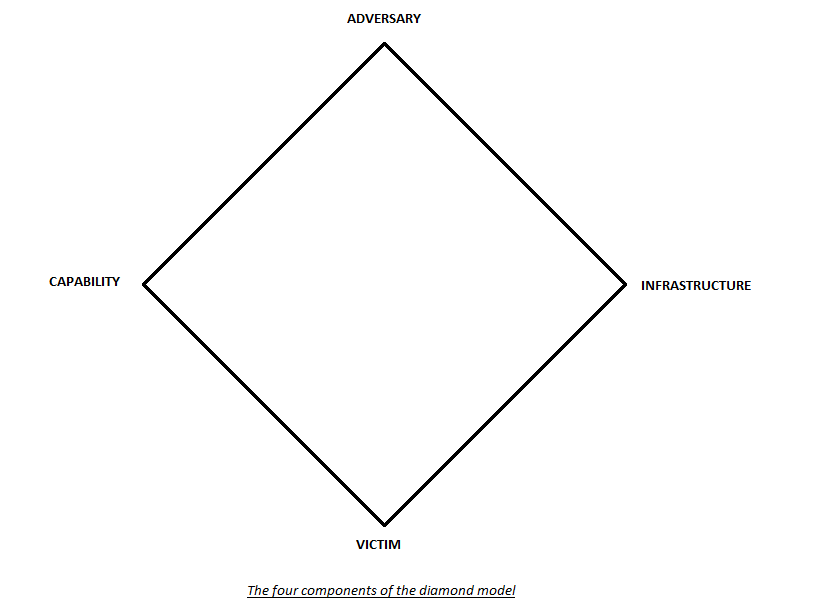

:orphan:
(attack-frameworks)=

# Attack Frameworks

In the ever-evolving landscape of cybersecurity, the battle between malicious actors and defenders intensifies with each passing day. As digital threats become more sophisticated and diverse, cybersecurity professionals are faced with the daunting task of understanding and mitigating these risks effectively. To combat these challenges, various attack frameworks have emerged as indispensable tools in the arsenal of cybersecurity experts. Among these, the Mitre ATT&CK framework, the Diamond Model of Intrusion Analysis, and the Cyber Kill Chain methodology have gained prominence for their comprehensive approaches to analyzing and understanding cyber threats. In this article, we explore these pivotal attack frameworks, exploring the crucial role they play in fortifying digital defenses against the relentless onslaught of cyber adversaries.

## The Significance of Using Attack Frameworks

Attack frameworks serve as structured methodologies designed to dissect and understand cyber threats comprehensively. These frameworks provide organizations with systematic approaches to analyze, categorize, and respond to various types of cyber attacks. The primary objective of attack frameworks is to enhance an organization's security posture by offering a detailed understanding of the tactics, techniques, and procedures (TTPs) employed by cyber adversaries. By dissecting attacks into distinct phases or components, these frameworks allow security professionals to identify vulnerabilities, predict attacker behavior, and proactively implement security measures to prevent, detect, and respond to potential breaches. Organizations utilize these frameworks as strategic tools to bolster their cybersecurity strategies, enabling them to prioritize security investments, train their staff effectively, and build resilient defense mechanisms against an ever-evolving array of cyber threats. By leveraging these frameworks, businesses can stay ahead of malicious actors, anticipate their moves, and ultimately safeguard their digital assets and sensitive information.

## MITRE ATT&CK

The MITRE ATT&CK framework stands as a seminal guide in the realm of cybersecurity, offering a comprehensive matrix detailing the intricate tactics and techniques employed by attackers on a system. Its utility spans various roles within the cybersecurity domain, serving as an invaluable resource for threat hunters, red teamers, and defenders. Threat hunters leverage the framework to proactively identify and investigate potential security threats, using its extensive database of attack patterns to recognize malicious behavior. Red teamers, on the other hand, employ ATT&CK to simulate real-world attack scenarios, enabling organizations to assess their security postures effectively. Defenders utilize the framework to understand the sequential steps adversaries take during an attack, allowing them to plan and implement proactive defense strategies. Whether it's analyzing ongoing attacks or preparing for future ones, the MITRE ATT&CK framework offers practical insights that empower cybersecurity professionals to stay one step ahead of cyber adversaries.

One of the key strengths of the MITRE ATT&CK framework lies in its ability to enhance an organization's defense capabilities significantly. This framework categorizes attacks into distinct activities such as initial access, execution, persistence, privilege escalation, defense evasion, credential access, discovery, lateral movement, collection, command and control, exfiltration, and impact. It thus provides a structured approach to understanding the anatomy of cyber threats. Using this framework allows defenders to anticipate attacker behavior, identify potential vulnerabilities, and fortify defenses accordingly. It acts as a proactive guide, enabling organizations to preemptively secure their IT landscapes. Furthermore, the framework's clear organization of techniques and sub-techniques paints a vivid picture of potential attack paths, empowering defenders to prioritize their security efforts based on real-world threat scenarios. By aligning their defenses with the insights derived from the MITRE ATT&CK framework, organizations can significantly bolster their resilience against a myriad of cyber threats.

Beyond its immediate applications, the MITRE ATT&CK framework serves as a rich knowledge repository for the cybersecurity community. It encapsulates real-world observations and empirical data regarding various attack techniques, making it a valuable resource for threat intelligence. This repository nature enables organizations to continuously learn from evolving cyber threats and adapt their security strategies in response. Additionally, it fosters a collaborative environment where cybersecurity professionals can share insights, tactics, and effective defense mechanisms.

## The Diamond Model of Intrusion Analysis

The Diamond Model for Intrusion Analysis represents a structured and systematic approach used in the realm of cybersecurity to dissect and comprehend specific cyber events. At its core, this model revolves around four key attributes, often referred to as nodes, which collectively provide a holistic understanding of any cyber intrusion. These nodes include the adversary, infrastructure, capability, and victim.

**Adversary Node:** The adversary node encapsulates all available information about the attacker. This encompasses details such as their email addresses, aliases, geographical locations, or any other identifiable data. Understanding the motivations and characteristics of the attacker is vital in comprehending the intent behind the intrusion. 

**Infrastructure Node:** The infrastructure node delves into the tools and resources employed during the attack. This includes elements like IP addresses, domain names, and communication channels. Examining the infrastructure sheds light on the technical aspects of the intrusion, allowing analysts to trace back malicious activities to their sources.

**Capability Node:** The capability node focuses on the techniques and resources utilized by the attacker. This can range from malware and exploits to stolen credentials or custom tools developed specifically for the attack. Analyzing the capability node provides insights into the attacker's skill set and the sophistication of the intrusion techniques. 

**Victim node:** The victim node provides information about the target of the attack. It outlines the impact of the intrusion on the victim, detailing the vulnerabilities exploited and the extent of the compromise.

By breaking down cyber incidents into these distinct nodes, the Diamond Model offers a structured and organized framework for intrusion analysis. This structured approach allows cybersecurity professionals to systematically analyze each aspect of the intrusion, providing a comprehensive understanding of the attack lifecycle. Consequently, organizations can identify patterns, recognize vulnerabilities, and assess the potential impact of similar attacks in the future. Armed with this knowledge, they can develop targeted and effective countermeasures, fortifying their defenses and mitigating the risks associated with cyber intrusions. Ultimately, the Diamond Model for Intrusion Analysis acts as a strategic tool, empowering organizations to proactively defend against evolving cyber threats and enhance their overall security posture.

## Cyber Kill Chain

The Cyber Kill Chain is a strategic model developed by Lockheed Martin, describing the stages of a cyberattack from the initial reconnaissance to the final objective completion. It serves as a roadmap for understanding the steps an attacker takes during a cyber intrusion, allowing security professionals to identify vulnerabilities and plan effective defense strategies.

### Key Stages of the Cyber Kill Chain

- **Reconnaissance:** Attackers gather information about potential targets.

- **Weaponization:** Malware or tools are prepared for exploitation.

- **Delivery:** Malware is delivered to the target system.

- **Exploitation:** Vulnerabilities are exploited to gain access.

- **Installation:** Malware establishes a foothold, ensuring persistence.

- **Command and Control:** Attackers establish communication channels for remote control.

- **Action on Objective:** Attackers achieve their intended goal, such as data theft or system disruption.

The Cyber Kill Chain allows security professionals to analyze attacks comprehensively. By understanding each stage, they can identify patterns, recognize indicators of compromise, and anticipate the attacker's next moves. This knowledge enables the development of targeted defenses at different points of the attack lifecycle. For instance, if an organization strengthens its defenses at the delivery stage, it can prevent malware from entering the system, disrupting the attack before it progresses further.

Understanding and utilizing the Cyber Kill Chain provide organizations with a significant strategic advantage. By preemptively analyzing attacks through the lens of the Kill Chain, they can proactively position defenses. This proactive stance allows for quicker detection, response, and mitigation, minimizing potential damage. Moreover, organizations can allocate resources effectively, focusing on specific stages where vulnerabilities are most likely to be exploited. Ultimately, the Cyber Kill Chain empowers organizations to fortify their cybersecurity posture, making it more resilient against a diverse range of cyber threats.