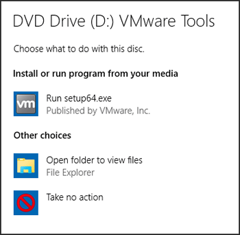

:orphan:
(best-practice-autorun-autoplay)=

# Workstation Security: AutoRun and AutoPlay Best Practices

In the realm of workstation security best practices, it is crucial to comprehensively understand and manage features such as AutoRun and AutoPlay. These are functionalities integrated into the Windows operating system that, while convenient for users, can pose significant security risks if not properly configured. In this article, we will delve into what AutoRun and AutoPlay are, the potential security threats they introduce, and the recommended best practices for mitigating these risks.

## What is AutoRun?

AutoRun is a feature in Microsoft Windows operating systems that automates the execution of certain actions when removable media, such as USB drives, CDs, or DVDs, are inserted into a computer. Essentially, AutoRun instructs the operating system to perform a predefined action, such as launching a specific program or opening a particular file, when it detects the presence of removable media.

The primary purpose of AutoRun is to enhance user convenience. For instance, when you insert a CD containing software, AutoRun can automatically initiate the installation process, saving users from having to manually execute setup files. While AutoRun can be advantageous in terms of user experience, it also introduces security vulnerabilities if not appropriately configured.

## What is AutoPlay?

AutoPlay, often confused with AutoRun, is another Windows feature related to the automatic handling of removable media. AutoPlay is responsible for determining how the system responds when a removable device is connected or when specific types of media are inserted.

Unlike AutoRun, AutoPlay does not automatically execute programs or files. Instead, it presents users with a list of options, allowing them to choose how they want to interact with the inserted media. These options typically include actions such as opening files, viewing pictures, playing videos, or launching software.

 

AutoPlay provides users with more control over how they interact with removable media, which can help mitigate some security risks associated with AutoRun. However, misconfigurations and user choices can still lead to security vulnerabilities.

## Security Threats Associated with AutoRun and AutoPlay

While AutoRun and AutoPlay were designed to enhance user convenience, they have become attractive vectors for malware and other security threats. Understanding the risks associated with these features is essential for implementing effective workstation security best practices.

### 1. Malware Propagation

One of the most significant security threats associated with AutoRun is the propagation of malware. Malicious actors often take advantage of AutoRun to spread malware infections. For example, they may create infected USB drives and distribute them in the hope that unsuspecting users will insert the drives into their computers. Once connected, AutoRun can automatically execute the malware, compromising the system.

### 2. Social Engineering Attacks

AutoPlay can also be exploited in social engineering attacks. Attackers may craft removable media with enticing labels or file names to trick users into selecting actions that lead to the execution of malicious code. This form of manipulation relies on user curiosity and can result in the unintended installation of malware or the exposure of sensitive information.

### 3. Unauthorized Data Access

Improperly configured AutoPlay settings can lead to unauthorized data access. For instance, if a user's AutoPlay settings are set to automatically open files from removable media, an attacker with physical access to the workstation can insert a malicious USB drive and gain access to sensitive documents or execute malicious scripts.

## Best Practices for AutoRun and AutoPlay

To mitigate the security risks associated with AutoRun and AutoPlay, it is essential to follow best practices for workstation security. The following guidelines outline recommended measures that organizations and users should implement:

### 1. Disable AutoRun and AutoPlay

Disabling AutoRun and AutoPlpay altogether is one of the most effective ways to reduce the risk of malware propagation through removable media.

#### Disable AutoPlay

To disable AutoRun for all types of removable media, including USB drives, CDs, and DVDs, users can use the Local Group Policy Editor. Please note that this method is applicable to Windows Pro, Enterprise, and Education editions. Here's how to do it:

1. Press `Win + R` to open the Run dialog.

2. Type `gpedit.msc` and press Enter to open the Local Group Policy Editor.

3. In the Local Group Policy Editor, navigate to `Computer Configuration -> Administrative Templates -> Windows Components -> AutoPlay Policies`.

4. Double-click on "Turn off AutoPlay" to open its properties.

5. Select the "Enabled" option to disable AutoPlay.

6. Click "Apply" and then "OK" to save the changes.

AutoRun is now disabled for all devices on the computer.

#### Disable AutoRun for Individual Drives

If you want to disable AutoRun for specific drives or devices while keeping it enabled for others, you can do so through the Windows Registry Editor. Please exercise caution when editing the registry, as making incorrect changes can affect the stability of your system.

Here are the steps to disable AutoRun for individual drives:

1. Press `Win + R` to open the Run dialog.

2. Type `regedit` and press Enter to open the Registry Editor.

3. Navigate to `HKEY_LOCAL_MACHINE\SOFTWARE\Microsoft\Windows\CurrentVersion\Policies\Explorer`.

4. In the right pane, right-click and select "New" -> "DWORD (32-bit) Value" to create a new DWORD value.

5. Name the new DWORD value as `NoDriveTypeAutoRun` and set its value data based on the drives you want to disable AutoRun for:

   - To disable AutoRun for all drives, set the value data to `0xFF`.
   - To disable AutoRun for specific drives, set the value data according to the drive types you want to disable. For example, to disable AutoRun for removable drives (USB drives), set the value data to `0x4`. Refer to the table below for common drive types:
        
        | Drive Type           | Value Data |
        |----------------------|------------|
        | Unknown              | 0x1        |
        | No Root Directory    | 0x2        |
        | Removable Drives     | 0x4        |
        | Fixed Drives         | 0x8        |
        | Network Drives       | 0x10       |
        | CD/DVD Drives        | 0x20       |
        | RAM Disks            | 0x40       |
        | Floppy Drives        | 0x80       |
        | Write-Once Drives    | 0x100      |
        | Remote Drives        | 0x200      |

        For example, to disable AutoRun for removable drives and CD/DVD drives, set the value data to `0x24`.

6. Click "OK" to save the changes.

7. Close the Registry Editor.

AutoRun is now disabled for the specified drives or drive types. Remember that you can always return to the Registry Editor and change the value data to re-enable AutoRun for these drives if needed.

### 2. Educate Users

User education plays a crucial role in workstation security. Organizations should provide training and awareness programs to educate users about the potential risks associated with removable media and how to make informed decisions when interacting with them. Users should be encouraged to:

- Avoid inserting unknown or untrusted removable media into their workstations.
- Be cautious when choosing actions in AutoPlay prompts, especially for unfamiliar media.
- Regularly update their antivirus software to detect and prevent malware infections.

### 3. Implement Device Control Solutions

Device control solutions, often included in endpoint security software, allow organizations to control which removable devices can be connected to workstations. These solutions enable administrators to whitelist authorized devices and restrict access to unknown or unauthorized devices.

By implementing device control solutions, organizations can enforce stricter control over which devices are allowed to interact with workstations, reducing the risk of malware introduction through removable media.

### 4. Keep Operating Systems and Software Updated

Regularly updating operating systems and software is a fundamental security best practice. Software updates often include security patches and fixes for vulnerabilities that could be exploited by malware delivered through AutoRun or AutoPlay. Users and administrators should ensure that their systems and security software are up to date to mitigate potential risks.

### 5. Use Antivirus and Anti-Malware Software

Employing robust antivirus and anti-malware software can help detect and remove malicious code that may be introduced through removable media. These security solutions can scan files on removable devices before they are executed, providing an additional layer of protection against malware threats.

### 6. Restrict Privileges

Limiting user privileges can help prevent the execution of malicious code. Users should not have administrative privileges on their workstations unless necessary for their job functions. By restricting privileges, organizations can reduce the impact of potential security incidents that may occur through AutoRun or AutoPlay.

## Final Words

AutoRun and AutoPlay are convenient features in the Windows operating system, but they can also introduce significant security risks if not properly managed. Malware propagation, social engineering attacks, and unauthorized data access are just a few of the security threats associated with these features.

Implementing workstation security best practices is essential to mitigate these risks. Disabling AutoRun, educating users, implementing device control solutions, keeping systems updated, using antivirus software, and restricting user privileges are all crucial steps in enhancing the security posture of workstations.