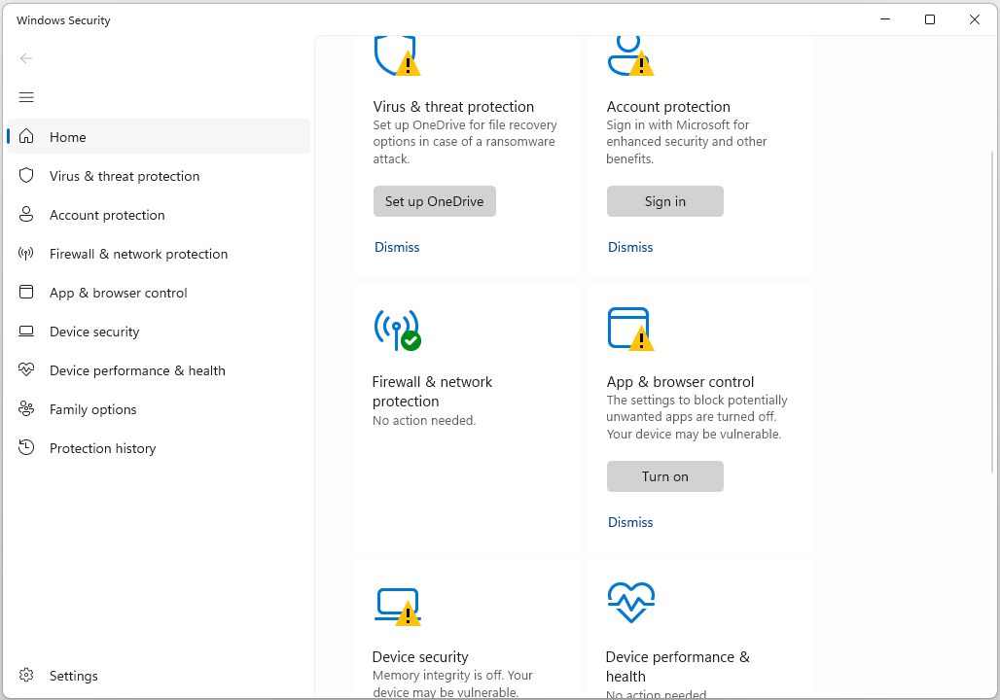

:orphan:
(configure-windows-defender)=

# Windows Defender Antivirus

Windows Defender, also known as Windows Security, is Microsoft's built-in antivirus and anti-malware software included with Windows operating systems. It plays a crucial role in protecting your computer from various security threats, including viruses, malware, and spyware. To ensure that your computer is adequately protected, it's essential to configure Windows Defender correctly. This guide will walk you through the essential steps and settings for configuring Windows Defender effectively.

## Why Configure Windows Defender?

Configuring Windows Defender is essential because it allows you to customize the security settings to suit your specific needs. By default, Windows Defender provides a reasonable level of protection for most users. However, adjusting its settings can enhance your computer's security and improve your overall experience. Additionally, configuring Windows Defender ensures that it runs efficiently and doesn't disrupt your workflow with unnecessary notifications.

 

## Accessing Windows Defender

Before diving into the configuration options, let's discuss how to access Windows Defender on your Windows computer:

1. **Open Windows Security**:
   - Press `Windows + S` on your keyboard to open the Windows search bar.
   - Type "Windows Security" and press Enter.
   - Alternatively, you can access it from the system tray by clicking the shield-shaped icon.

Now that you have accessed Windows Defender, let's explore the various settings you can configure.

## Configuring Windows Defender Settings

### 1. **Virus & Threat Protection Settings**

The Virus & Threat Protection settings are the core of Windows Defender's configuration. To access these settings, follow these steps:

1. Open Windows Security as mentioned earlier.
2. Click on "Virus & Threat Protection" in the left sidebar.

#### a. Real-time Protection

Real-time protection is the feature that scans files and programs as they are accessed or opened. It's crucial to keep this feature enabled to ensure that Windows Defender can detect and block threats in real-time. By default, it should be turned on. To verify its status:

1. Under "Virus & Threat Protection settings," locate "Real-time protection."
2. Ensure that the toggle switch is set to "On."

#### b. Cloud-delivered Protection

Cloud-delivered protection enhances the accuracy and speed of threat detection by using Microsoft's cloud infrastructure. This feature should also be enabled by default. To confirm its status:

1. Under "Virus & Threat Protection settings," find "Cloud-delivered protection."
2. Ensure that the toggle switch is set to "On."

#### c. Automatic Sample Submission

Automatic sample submission allows Windows Defender to collect and send suspicious files to Microsoft for analysis. This helps improve the overall security of Windows Defender. To check its status:

1. Under "Virus & Threat Protection settings," look for "Automatic sample submission."
2. Ensure that the toggle switch is set to your preferred option, typically "On."

### 2. **App & Browser Control Settings**

The App & Browser Control settings in Windows Defender focus on protecting your computer while using applications and browsing the internet. To access these settings:

1. Open Windows Security.
2. Click on "App & Browser Control" in the left sidebar.

#### a. Reputation-based Protection

Reputation-based protection helps Windows Defender identify potentially harmful files and apps. It uses reputation data to determine whether a file or app is trustworthy or not. This feature is usually set to "Warn" by default. To configure it:

1. Under "Reputation-based protection settings," click on "Reputation-based protection settings."
2. Choose your preferred option: "Block," "Warn," or "Off."

#### b. SmartScreen for Microsoft Edge

SmartScreen for Microsoft Edge is a security feature that helps protect you from malicious websites and downloads while using the Microsoft Edge browser. To configure this feature:

1. Under "SmartScreen settings for Microsoft Edge," click on "SmartScreen for Microsoft Edge settings."
2. Choose your preferred option: "Block," "Warn," or "Off."

### 3. **Firewall & Network Protection Settings**

Windows Defender also includes a built-in firewall to protect your computer from unauthorized network access. To configure Firewall & Network Protection settings:

1. Open Windows Security.
2. Click on "Firewall & Network Protection" in the left sidebar.

#### Network Profile

Windows allows you to set different firewall rules for different network profiles: Public, Private, and Domain. To configure network profiles:

1. Under "Firewall & Network Protection settings," click on "Change notification settings" next to your current network profile (e.g., Public network).
2. Choose your preferred notification settings for each network profile.

#### b. Allow an App Through Firewall

If you want to allow a specific app through the firewall, you can configure this under "Allow an app through firewall." Here's how:

1. Under "Firewall & Network Protection settings," click on "Allow an app through firewall."
2. Click "Change settings."
3. Select the app you want to allow or block.
4. Check or uncheck the boxes under "Private" and "Public" depending on your preference.

### 4. **Device Security Settings**

The Device Security settings in Windows Defender provide information about the security status of your device. To access these settings:

1. Open Windows Security.
2. Click on "Device Security" in the left sidebar.

#### Core Isolation and Memory Integrity

Core Isolation and Memory Integrity are advanced security features that protect your computer from sophisticated attacks. To check their status:

1. Under "Device Security," click on "Core Isolation and Memory Integrity."
2. Ensure that both features are turned on if supported by your hardware.

### 5. **Account Protection Settings**

Windows Defender also offers account protection settings, which are particularly relevant if you use a Microsoft account to log in to your computer. To access these settings:

1. Open Windows Security.
2. Click on "Account Protection" in the left sidebar.

#### Windows Hello Face/Fingerprint Recognition

If your computer supports Windows Hello face or fingerprint recognition, you can configure it for added security. To set up Windows Hello:

1. Under "Account Protection," click on "Set up" under "Windows Hello Face" or "Windows Hello Fingerprint," depending on your device's capabilities.
2. Follow the on-screen instructions to set up Windows Hello.

### 6. **Device Performance & Health Settings**

Device Performance & Health settings in Windows Defender provide insights into the overall health of your computer, including security updates and storage space. To access these settings:

1. Open Windows Security.
2. Click on "Device Performance & Health" in the left sidebar.

#### Fresh Start

Fresh Start is a feature that allows you to reinstall Windows while keeping your personal files and some settings intact. This can be useful if your computer is experiencing serious issues. To initiate a Fresh Start:

1. Under "Device Performance & Health," click on "Additional info."
2. Click on "Get started" under "Fresh Start."

## Customizing Windows Defender Notifications

Windows Defender may occasionally display notifications about detected threats or security issues. These notifications can be useful, but they can also be disruptive if you receive too many of them. To customize Windows Defender notifications:

1. Open Windows Security.
2. Click on "Settings" at the bottom of the left sidebar.
3. Under "Notifications," you can toggle various notification types on or off based on your preference.

## Manual Scans and Updates

In addition to configuring the settings mentioned above, it's a good practice to perform manual scans

 and ensure that your antivirus definitions are up to date.

### Performing a Manual Scan

1. Open Windows Security.
2. Click on "Virus & Threat Protection."
3. Under "Quick Scan," click "Quick Scan" for a fast check or "Full Scan" for a comprehensive scan of your computer.

### Updating Antivirus Definitions

Keeping your antivirus definitions up to date is crucial for effective protection. To update Windows Defender antivirus definitions manually:

1. Open Windows Security.
2. Click on "Virus & Threat Protection."
3. Under "Virus & Threat Protection updates," click "Check for updates."

## Final Words

Configuring Windows Defender is a critical step in ensuring the security of your Windows computer. By customizing the settings to your preferences and regularly performing manual scans and updates, you can significantly enhance your computer's protection against viruses, malware, and other security threats. Remember that while these settings provide a high level of security, it's essential to practice safe computing habits, such as being cautious when downloading files or clicking on links, to maintain a secure computing environment.
