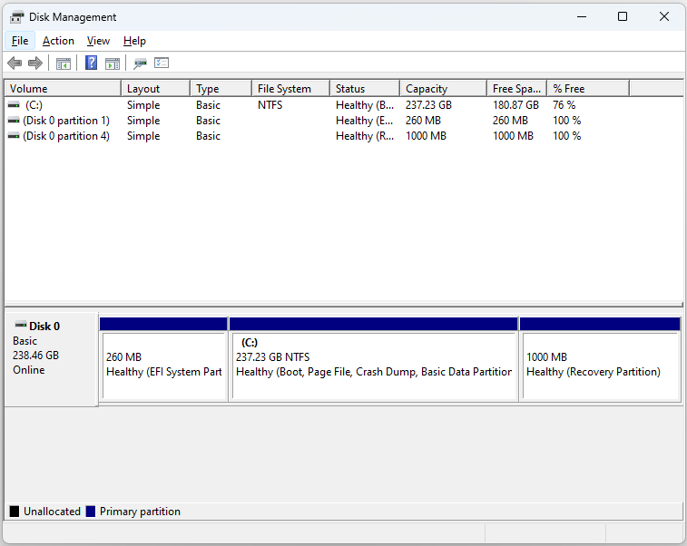
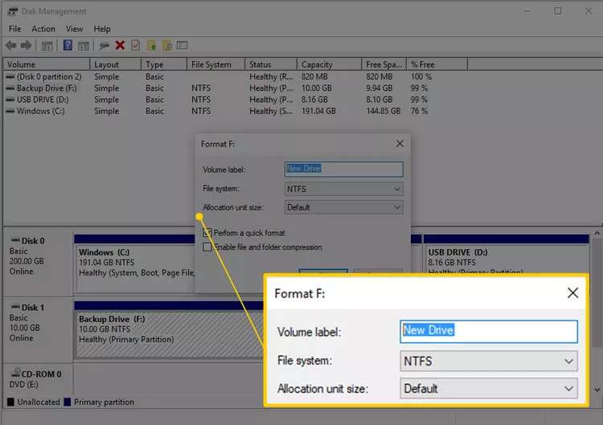

:orphan:
(drive-partitioning-formatting)=

# Partitioning and Formatting Drives

In the realm of computer storage, the concepts of partitioning and drive format play crucial roles in organizing and utilizing storage devices efficiently. These fundamental concepts underpin the structure and functionality of hard drives and other storage media. In this article, we will delve into the definitions, purposes, and methods of partitioning and drive formatting, along with their significance in the digital world.

## Partitioning

**Partitioning** refers to the division of a physical storage device, such as a hard drive or SSD (Solid State Drive), into separate sections, each of which behaves as an independent logical unit. Each partition is assigned its own file system and can be used to store data and files. 

 

Partitioning serves several important purposes in computer storage:

1. **Organization**: By creating multiple partitions on a single storage device, users can better organize their data. For example, they can separate system files from personal files, or segregate different types of data based on their usage, like having a partition for media files and another for documents.

2. **Operating System Isolation**: One of the primary use cases for partitioning is isolating the operating system (OS) from user data. This helps protect the OS from corruption due to accidental user actions or malware infections. If the OS partition becomes corrupted, user data on other partitions may remain unaffected.

3. **Multi-Boot Configurations**: Partitioning facilitates the creation of multiple bootable operating system installations on a single storage device. This is particularly useful for software development, testing, or running different operating systems for various tasks.

4. **Backup and Recovery**: When backups are stored on a separate partition, they can be isolated from the rest of the system and less prone to data loss. If the main partition encounters issues, backups stored on another partition can be used to restore the system.

### Types of Partitions

Two common types of partitions are **Primary** and **Extended** partitions. Each of these has its own characteristics and purposes:

1. **Primary Partition**: A primary partition is a standalone partition that can be used to install an operating system and store data. Most computers can have up to four primary partitions on a single storage device. If you intend to install an OS on a partition, it must be set as primary.

2. **Extended Partition**: An extended partition is a special type of partition that acts as a container for logical partitions. Unlike primary partitions, you cannot directly install an operating system on an extended partition. Instead, you create logical partitions within the extended partition to organize data further.

### Example: Windows and Mac Drive Partitioning

Here's how to partition a drive in Windows and Mac OS:

1. **Backup Data**: Before you begin, ensure that you have backed up any important data on the drive. Partitioning involves making changes to the drive's structure, which could result in data loss.

2. **Access Disk Management (Windows) or Disk Utility (Mac)**:
   - **Windows**: Press `Win + X` and select "Disk Management."
   - **Mac**: Open "Applications," go to "Utilities," and launch "Disk Utility."

3. **Identify the Drive**: In the disk management tool, identify the drive you want to partition. Be cautious to select the correct drive to avoid accidental data loss.

4. **Shrink or Resize**: For Windows users, right-click on the drive you want to partition and select "Shrink Volume." Specify the amount of space you want to allocate for the new partition. For Mac users, click on the drive and then click "Partition." Use the handle to resize the existing partition.

5. **Create a New Partition (Windows)**:
   - After shrinking the volume, right-click on the unallocated space and choose "New Simple Volume."
   - Follow the wizard's instructions to specify the size, assign a drive letter, and format the partition.

6. **Create a New Partition (Mac)**:
   - After resizing the existing partition, click the "+" button under the partition layout.
   - Specify the size, name, and format for the new partition.

7. **Format the Partition**: During the partition creation process, you'll be prompted to choose a file system format. Select the appropriate format based on your needs (NTFS for Windows, APFS or HFS+ for Mac, etc.).

8. **Complete the Wizard (Windows)**: Follow the remaining steps in the wizard to complete the partition creation and formatting process.

9. **Apply Changes (Mac)**: Once you've configured the new partition, click "Apply" to commit the changes.

## Formatting

**Drive formatting**, also known as **file system formatting**, involves preparing a partition or storage device for data storage by creating a file system on it. A file system is a structure that dictates how data is organized, stored, and accessed on the storage medium. Different operating systems support various file systems, each with its own characteristics and benefits.

 

### Common File Systems

Several file systems are commonly used in different operating systems:

1. **NTFS (New Technology File System)**: This file system is widely used in Windows operating systems. NTFS supports large file sizes, offers file-level security, and enables features like compression and encryption. It's suitable for both personal use and business environments.

2. **FAT32 (File Allocation Table 32)**: FAT32 is an older file system that is compatible with various operating systems, including Windows, macOS, and Linux. However, it has limitations such as a maximum file size of 4 GB, which can be restrictive for modern uses.

3. **exFAT (Extended File Allocation Table)**: exFAT is an extension of FAT32 that addresses some of its limitations. It supports larger file sizes and is compatible with various platforms. exFAT is often used for flash drives and external hard drives where cross-platform compatibility is important.

4. **HFS+ (Hierarchical File System Plus)**: HFS+ is the file system used on macOS. It provides features like journaling, which enhances data integrity in case of sudden power loss or system crashes.

5. **APFS (Apple File System)**: APFS is the successor to HFS+ and is optimized for modern SSDs and flash storage. It offers improved performance, enhanced data integrity, and efficient use of storage space.

6. **EXT4**: The EXT4 file system is commonly used in Linux distributions. It supports large file sizes, journaling for data recovery, and efficient storage allocation.

### The Drive Formatting Process

Drive formatting involves the following steps:

1. **Selecting the File System**: Choose an appropriate file system based on the intended use and the operating systems you'll be working with. Different file systems have varying features, compatibility, and limitations.

2. **Backup Data**: Before formatting a drive, back up any important data to prevent data loss. Formatting erases all data on the selected partition.

3. **Formatting the Drive**: Use the operating system's built-in tools or third-party software to format the drive. This process involves creating the necessary data structures and file system metadata on the partition.

4. **Labeling and Allocation**: Assign a label or name to the partition for easy identification. Allocate the desired amount of space to the partition. Some file systems may also allow you to set advanced options during formatting.

### Example: Windows and Mac Drive Formatting

Here's how to format a drive in Windows and Mac OS:

1. **Backup Data**: Just as with partitioning, ensure you've backed up any important data on the partition you're about to format.

2. **Access Disk Management (Windows) or Disk Utility (Mac)**: Follow the same steps as mentioned earlier to access the appropriate tool.

3. **Locate the Partition**: In the disk management tool, locate the partition you want to format. Be careful not to select the wrong partition, as formatting erases all data on it.

4. **Format the Partition (Windows)**:
   - Right-click on the partition and choose "Format."
   - Select the desired file system from the dropdown menu (e.g., NTFS, exFAT) and provide a name for the partition.
   - Optionally, adjust allocation unit size and perform a quick format if needed.

5. **Format the Partition (Mac)**:
   - Click on the partition and then click "Erase."
   - Choose the appropriate format (APFS, HFS+, exFAT, etc.) and provide a name for the partition.

6. **Confirm Formatting**: Review the settings to ensure they're correct, as formatting will erase all data on the partition.

7. **Complete the Formatting**: Click "Format" or "Erase" to begin the formatting process. Depending on the size of the partition, this might take a few moments.

8. **Confirmation**: Once the formatting is complete, you'll receive a confirmation message. Your partition is now ready to use with the selected file system.

## Importance of Partitioning and Drive Formatting

Partitioning and drive formatting are fundamental aspects of storage management with several key benefits:

1. **Data Organization**: Partitioning allows users to organize their data in a structured manner, improving data accessibility and management.

2. **Data Protection**: Isolating the operating system and user data through partitioning helps safeguard critical system files from accidental corruption and malware attacks.

3. **Efficient Backup**: Storing backups on separate partitions prevents them from being affected by issues that might occur on the main partition, ensuring reliable recovery options.

4. **Multi-Boot Flexibility**: Partitioning enables the creation of multi-boot setups, which are valuable for developers, testers, and individuals who need to use multiple operating systems.

5. **Compatibility**: Selecting an appropriate file system during drive formatting ensures compatibility with different operating systems and devices, allowing seamless data transfer.

6. **Optimized Performance**: Choosing the right file system for the storage medium can result in improved performance, especially when using SSDs or flash drives.

## Conclusion

In the realm of computer storage, partitioning and drive formatting are essential practices that influence the structure, organization, and functionality of storage devices. Partitioning enables the logical separation of storage space for improved data organization, protection, and multi-boot configurations. Drive formatting, on the other hand, involves preparing partitions with appropriate file systems, ensuring compatibility and efficient data management across different operating systems.

By understanding the concepts of partitioning and drive formatting, users can make informed decisions when setting up and managing their storage devices, enhancing data security, accessibility, and overall system performance. Whether it's isolating the operating system, organizing data, or enabling multi-boot scenarios, these practices play a critical role in maintaining an efficient and reliable computing environment.
