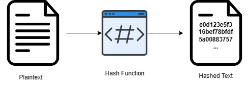

:orphan:
(hashing-enterprise-data)=

# The Significance of Hashing in Safeguarding Enterprise Data

In an era where data is the backbone of businesses, protecting enterprise data has become an absolute imperative. The rise in cyber threats and data breaches underscores the critical importance of data security. Hashing, a fundamental concept in cryptography, plays a pivotal role in safeguarding enterprise data. In this article, we'll delve into the significance of hashing in the protection of enterprise data, exploring its usefulness in modern data security strategies.

## Understanding Hashing

Hashing is a process that takes any input data and converts it into a fixed-length string of characters, commonly a hexadecimal number. The resulting string, known as a hash value or hash code, is unique to the input data. This uniqueness ensures that even a minor change in the input data will produce a significantly different hash value. Hash functions are designed to be one-way, meaning it's computationally infeasible to reverse the process and obtain the original data from its hash value. This characteristic is central to its role in data security.

## The Significance of Hashing in Enterprise Data Management

This section emphasizes how hashing plays a pivotal role in effectively managing an organization's data.

### Data Integrity Assurance

Hashing serves as a powerful tool for ensuring data integrity within an enterprise. By generating hash values for files, documents, or any sensitive information, organizations can verify that data remains unchanged during transmission or storage. If the hash value of the received data matches the original hash value, it's a strong indicator that the data hasn't been tampered with.

### Secure Password Storage

One of the most prevalent applications of hashing in enterprise data protection is the secure storage of user passwords. Instead of storing passwords in plaintext, organizations hash them before storage. When a user logs in, the entered password is hashed and compared to the stored hash value. Even in the event of a data breach, attackers cannot easily reverse-engineer the actual passwords.

### Digital Signatures

Digital signatures rely on hashing for authenticity and non-repudiation in digital communications. When a document is digitally signed, a hash value of the document is created and encrypted with the sender's private key. Recipients can verify the signature's validity by decrypting the hash value with the sender's public key and comparing it to a newly computed hash value of the received document. Any changes to the document would result in a mismatch, indicating tampering.

### Enhanced Cryptographic Security

Hash functions are integral components of various cryptographic protocols and algorithms. They play a critical role in creating secure message digests, key derivation, and ensuring the security of blockchain networks. Hashing strengthens data encryption, making it considerably more challenging for malicious actors to breach cryptographic systems.

### Efficiency through Data Deduplication

In enterprise environments, optimizing data storage and bandwidth efficiency is crucial. Hashing is employed to identify duplicate data, allowing organizations to store only one instance of each unique piece of information. This not only conserves storage space but also reduces data transfer times, enhancing operational efficiency.

## Conclusion

In today's data-driven landscape, the protection of enterprise data is paramount. Hashing provides a robust defense against cyber threats and helps maintain customer trust in an age where data breaches are a constant concern. As businesses continue to rely on data as a strategic asset, embracing hashing as a fundamental security measure is not just a best practice—it's a necessity for the preservation of sensitive information and the continuity of operations.