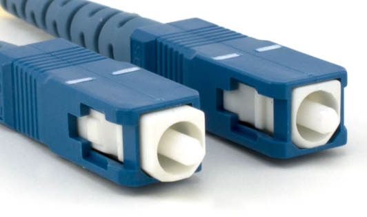

:orphan:
(network-connector-types)=

# Network Connector Types

Connectors play a pivotal role in the field of networking by enabling the physical connection of various devices and components within a network. They come in a variety of types, each designed for specific purposes. In this article, we will delve into the different connector types used in networks, explore their advantages and disadvantages, and discuss their relevant use cases.

## Introduction to Connectors in Networks

Connectors are essential components in networking infrastructure, facilitating the establishment of electrical or optical connections between devices, cables, and network components. These connectors are designed to ensure secure and reliable data transmission, as well as physical stability in a network environment.

## Types of Connectors

There are several types of connectors used in networks, each with its unique characteristics and applications. Below, we will discuss some of the most common connector types:

### **RJ-45 Connector**

The RJ-45 connector is a standard connector used for Ethernet networking. It is recognized for its simplicity, comprising eight pins arranged in a modular jack design. RJ-45 connectors are widely utilized in both residential and commercial settings for establishing wired network connections. They are easily terminated with twisted-pair cables and are known for their reliability.

 

- **Advantages**

  - Universally used for Ethernet connections.
  - Offers a secure and reliable connection.
  - Simple to install and widely available.
  - Suitable for both residential and commercial networking applications.

- **Disadvantages**

  - Limited to copper-based Ethernet connections.
  - Not suitable for high-speed or long-distance connections.
  - Prone to wear and tear in heavy usage scenarios.

- **Use Cases**

  - Home and office networking.
  - Local area networks (LANs).
  - Ethernet connections in data centers.

### **LC Connector**

The LC connector is a small-sized optical fiber connector. It is designed to facilitate high-speed data transmission through optical fibers and is compatible with both single-mode and multi-mode fibers. LC connectors are characterized by their compact, push-pull design, which makes them suitable for high-density networking environments. They are known for their low insertion loss and high precision connections.

 

- **Advantages**

  - Designed for high-speed optical connections.
  - Provides low insertion loss and high precision.
  - Suitable for both single-mode and multi-mode fiber optics.
  - Compact and ideal for high-density applications.

- **Disadvantages**

  - Requires more care during installation due to its small size.
  - More expensive than some other connectors.

- **Use Cases**

  - Data centers for high-speed optical networking.
  - Fiber-to-the-Home (FTTH) installations.
  - Telecommunications networks.

### **SC Connector**

The SC connector is another optical fiber connector commonly used in networking. It is renowned for its simplicity and reliability, featuring a push-pull mechanism. SC connectors can be employed with both single-mode and multi-mode optical fibers, making them versatile for various optical networking applications. Their design ensures secure connections in critical data transfer scenarios.

 

- **Advantages**

  - Simple push-pull mechanism for easy installation.
  - Provides reliable and low-loss optical connections.
  - Suitable for both single-mode and multi-mode fiber optics.

- **Disadvantages**

  - Not as compact as LC connectors.
  - Requires more space in high-density environments.

- **Use Cases**

  - Fiber optic networks in corporate environments.
  - Cable television (CATV) networks.
  - Military and aerospace applications.

### **USB Connector**

The USB (Universal Serial Bus) connector is a ubiquitous interface used for connecting a diverse range of peripherals to computers and other devices. It supports both data transmission and power delivery, depending on the specific USB version. USB connectors come in various forms, including USB-A, USB-B, and USB-C, each serving specific functions and use cases. They are notable for their ease of use and widespread adoption in consumer electronics.

 

- **Advantages**

  - Versatile and widely used for connecting various peripherals.
  - Supports both data and power transmission (USB Power Delivery).
  - Available in multiple versions, including USB-A, USB-B, USB-C.

- **Disadvantages**

  - USB connectors can wear out over time with frequent plugging and unplugging.
  - Compatibility issues may arise with different USB versions.

- **Use Cases**

  - Connecting keyboards, mice, printers, and other peripherals to computers.
  - Charging smartphones, tablets, and laptops.
  - Data transfer between devices.

### **F-Type Connector**

The F-Type connector is primarily utilized for cable television (CATV) and satellite TV connections. It is designed to provide reliable signal quality for television broadcasts and features a screw-on design for secure connections. F-Type connectors are specialized for video and television applications, making them a common choice for connecting cable TV equipment and distributing TV signals within homes and businesses.

 

- **Advantages**

  - Primarily used for cable television (CATV) and satellite TV connections.
  - Provides good signal quality for television broadcasts.
  - Screw-on design ensures a secure connection.

- **Disadvantages**

  - Limited to video and television applications.
  - Not suitable for high-speed data connections.

- **Use Cases**

  - Connecting cable or satellite television equipment.
  - Distribution of TV signals within homes and businesses.
  - Some broadband internet connections via cable.

## Examples

Different connector types are suited to specific use cases based on their characteristics. Let's explore some common use cases for various connectors:

### 1. Ethernet Connectivity with RJ-45 Connectors

   - **Use Case**: RJ-45 connectors are widely used for Ethernet connections in homes, offices, and data centers. They are the standard choice for connecting computers, switches, routers, and other network devices. 

   - **Example**: When you connect your computer to a router using an Ethernet cable, you are likely using RJ-45 connectors on both ends of the cable.

### 2. Optical Fiber Networking with LC and SC Connectors

   - **Use Case**: LC and SC connectors are commonly used in optical fiber networks for high-speed data transmission. LC connectors are preferred for their compact design, while SC connectors are known for their reliability.

   - **Example**: In a data center, LC connectors are used to connect servers to optical switches, ensuring high-speed data transfer between equipment.

### 3. Peripherals and Data Transfer with USB Connectors

   - **Use Case**: USB connectors are versatile and are used for connecting a wide range of peripherals to computers and other devices. They are also employed for data transfer and charging.

   - **Example**: Plugging in a USB flash drive to transfer files from a computer or connecting a smartphone to a charger using a USB cable.

### 4. Television and Satellite Connections with F-Type Connectors

   - **Use Case**: F-Type connectors are primarily used for connecting cable television (CATV) and satellite TV equipment to TVs and set-top boxes.

   - **Example**: Connecting a cable TV box to a television using an F-Type connector to watch cable channels.

## Importance of Connector Types in Networks

The selection of the right connector type is crucial in network design and deployment. Using the appropriate connector ensures reliable and efficient data transmission while avoiding compatibility issues. It also contributes to the overall performance and longevity of the network.

## Final Words

Connectors are the physical interface that makes network connections possible. They come in various types, each tailored to specific applications, and offer a balance between advantages like compatibility and reliability, and disadvantages such as signal loss and wear. Understanding the role and characteristics of different connector types is essential for building and maintaining robust network infrastructures that meet the diverse connectivity needs of modern computing and communication systems.