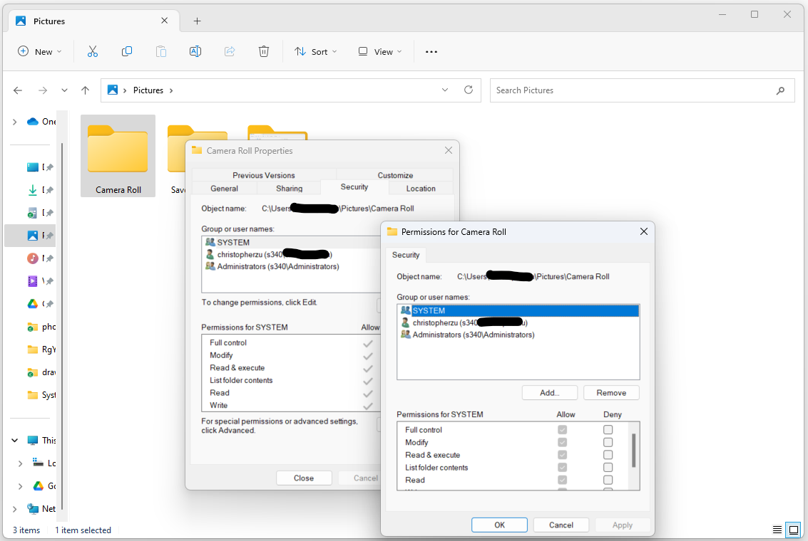
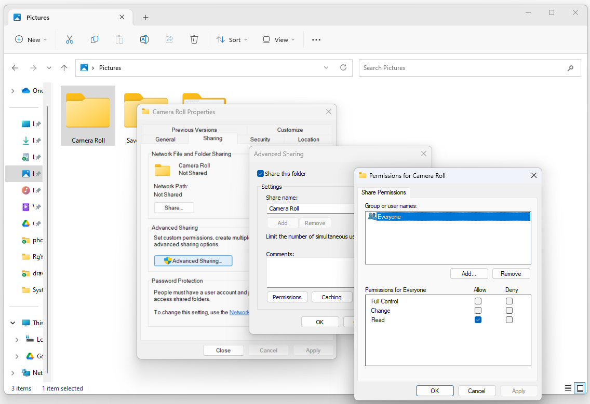

:orphan:
(ntfs-vs-share-permissions)=

# NTFS vs. Share Permissions in Windows

In the realm of Windows operating systems, security and access control are of paramount importance to ensure the confidentiality, integrity, and availability of data. NTFS (New Technology File System) and share permissions are two key components that work in tandem to regulate access to files and folders on a Windows-based file server. This article will delve into the distinctions between NTFS and share permissions, elucidating their functions, how they interact, and when to use each of them.

## NTFS Permissions

NTFS permissions, short for New Technology File System permissions, are file and folder level access controls. These permissions are primarily associated with the underlying file system and are set on an NTFS-formatted volume. NTFS permissions offer a granular level of control over who can access a particular file or folder and what actions they can perform. These actions include reading, writing, modifying, deleting, and executing files and folders.

### Key Features of NTFS Permissions

1. **Granularity**: NTFS permissions allow you to specify permissions not only for user accounts but also for groups, making it possible to manage access for multiple users simultaneously.

2. **Inheritance**: NTFS permissions can be inherited, meaning that permissions set on a parent folder can propagate to its subfolders and files. This simplifies the management of permissions across a directory structure.

3. **Explicit Deny**: NTFS permissions support explicit deny permissions, which take precedence over allow permissions. If a user or group is explicitly denied access to a file or folder, that denial will override any conflicting allow permissions.

4. **Effective Permissions**: You can calculate effective permissions for a user or group on a particular file or folder. This helps in determining the actual access a user has based on their individual permissions and group memberships.

### NTFS Permission Levels

NTFS permissions are categorized into the following levels:

1. **Full Control**: Users with Full Control can perform all actions on the file or folder, including reading, writing, modifying, deleting, and changing permissions.

2. **Modify**: This level allows users to read, write, modify, and delete files and folders. However, they cannot change permissions.

3. **Read & Execute**: Users can view and execute files, but they cannot modify or delete them.

4. **List Folder Contents**: Users can view the contents of a folder but cannot access the files within unless they have additional permissions on those files.

5. **Read**: Users can only view the contents of files and folders but cannot make any changes.

6. **Write**: Users can create new files and folders but cannot access existing ones unless they have additional permissions.

### Example Scenario: Using NTFS Permissions

Let's consider a scenario where a company wants to restrict access to a sensitive financial report. They have a shared folder named "Financial Reports" on a file server.

1. **Folder-Level Permissions**: The administrator sets NTFS permissions on the "Financial Reports" folder. They grant the "Finance Team" group Full Control and the "Marketing Team" group Read-only access.

2. **File-Level Permissions**: Within the "Financial Reports" folder, there is a file named "Q3_Financials.xlsx." The administrator grants the "CEO" user Full Control over this specific file, even though the CEO is a member of the "Finance Team" group.

In this scenario, the "Finance Team" can access and modify the contents of the "Financial Reports" folder, while the "Marketing Team" can only read the contents. However, the CEO, despite being part of the "Finance Team," has Full Control over the specific file, "Q3_Financials.xlsx."

## Share Permissions

Share permissions, on the other hand, are broader in scope and pertain to network shares. These permissions regulate access to shared resources, such as folders or printers, across a network. Share permissions are applied at the share level and are often used in conjunction with NTFS permissions to control who can access the shared resource over the network.

### Key Features of Share Permissions

1. **Network-based**: Share permissions control access to a shared resource over the network. They are not tied to the file system but are specific to the shared folder or printer.

2. **Simplified**: Share permissions are simpler in comparison to NTFS permissions. They consist of only three basic settings: Read, Change, and Full Control.

3. **Interaction with NTFS Permissions**: Share permissions can be combined with NTFS permissions to determine the effective permissions a user has. When a user accesses a file or folder over the network, the more restrictive of the share and NTFS permissions is applied.

### Share Permission Levels

Share permissions include three levels:

1. **Read**: Users with Read permissions can view and access the contents of the shared resource but cannot make any changes.

2. **Change**: Users with Change permissions can read and modify files and folders within the shared resource but cannot change permissions.

3. **Full Control**: Users with Full Control permissions can read, modify, delete, and change permissions for files and folders within the shared resource.

### Example Scenario: Using Share Permissions

Imagine a scenario where a small office has a shared folder named "Projects" on their file server.

1. **Share-Level Permissions**: The administrator configures share permissions for the "Projects" folder. They grant the "Team Members" group Change permissions and the "Managers" group Full Control.

2. **NTFS-Level Permissions**: At the NTFS level, the administrator sets more specific permissions. Within the "Projects" folder, there are subfolders for each project. The administrator grants the "Project A Team" group Full Control over the "Project A" subfolder, ensuring that only members of that group can fully control the contents of that specific project.

In this scenario, members of the "Team Members" group can modify files within the "Projects" folder, but they can't change folder-level permissions. The "Managers" group, on the other hand, has Full Control over the share and can change permissions as needed. Additionally, the "Project A Team" has Full Control over the "Project A" subfolder, allowing them exclusive access to that project.

## Configuration

### NTFS Permissions

 

NTFS permissions control access at the file and folder level. Follow these steps to configure NTFS permissions:

1. In the "Properties" window for the folder, go to the "Security" tab.

2. Click the "Edit" button to modify NTFS permissions.

3. In the "Permissions for [Folder Name]" window, you will see a list of users and groups with their corresponding permissions. To add a new user or group, click the "Add" button.

4. In the "Select Users or Groups" window, enter the name of the user or group you want to grant permissions to, and click "Check Names" to validate. Once validated, click "OK."

5. In the "Permissions for [User or Group]" section, you can configure the desired permissions by checking or unchecking the boxes for "Full Control," "Modify," "Read & Execute," "List Folder Contents," "Read," and "Write."

6. Click "Apply" to save the changes, and then click "OK" to close the "Permissions for [User or Group]" window.

7. Back in the "Security" tab, you will see the updated permissions for the selected user or group. Repeat steps 4 to 6 to add more users or groups and configure their permissions as needed.

8. Click "OK" to close the "Properties" window.

### Share Permissions

 

Share permissions control access to the shared folder over the network. Follow these steps to configure share permissions:

1. In the "Properties" window for the folder, switch to the "Sharing" tab.

2. Click the "Advanced Sharing" button.

3. In the "Advanced Sharing" window, check the box for "Share this folder." You can also specify a share name, which is the name that users will use to access the shared folder over the network.

4. Click the "Permissions" button to configure share permissions.

5. In the "Permissions for [Folder Name]" window, you will see a list of users and groups with their corresponding share permissions. By default, "Everyone" is given "Read" access. To add a new user or group, click the "Add" button.

6. In the "Select Users or Groups" window, enter the name of the user or group you want to grant share permissions to, and click "Check Names" to validate. Once validated, click "OK."

7. In the "Permissions for [User or Group]" section, you can configure the desired share permissions by checking or unchecking the boxes for "Full Control," "Change," and "Read."

8. Click "Apply" to save the changes, and then click "OK" to close the "Permissions for [User or Group]" window.

9. Back in the "Advanced Sharing" window, you will see the updated share permissions for the selected user or group. Repeat steps 5 to 8 to add more users or groups and configure their share permissions as needed.

10. Click "OK" to close the "Advanced Sharing" window.

## Interaction Between NTFS and Share Permissions

To effectively manage access to files and folders on a Windows file server, it's common to use both NTFS and share permissions together. When these two types of permissions are combined, the most restrictive set of permissions takes precedence. This means that if a user has Full Control at the share level but only Read access at the NTFS level, their effective permissions will be Read.

It's essential to understand this interaction to ensure that the desired level of security is maintained. In practice, share permissions are often set to allow Everyone or Authenticated Users Read access at the share level, while the more granular NTFS permissions dictate the actual access for different user groups or individuals.

## Best Practices

Here are some best practices for managing NTFS and share permissions:

1. **Use Principle of Least Privilege**: Assign permissions at the lowest level necessary for users to perform their tasks. Avoid giving users more access than they require.

2. **Regularly Review and Audit Permissions**: Periodically review and audit both NTFS and share permissions to ensure they align with the organization's security policies.

3. **Avoid Overlapping Permissions**: Minimize complexity by avoiding overlapping permissions. Conflicting permissions can lead to unexpected access issues.

4. **Document Permissions**: Keep thorough documentation of permissions, especially when multiple administrators manage the file server. This helps prevent unintentional changes.

5. **Test Permissions**: Before applying permissions in a production environment, test them in a controlled environment to ensure they work as intended.

6. **Backup Permissions**: Regularly back up and document your permissions settings, especially before making significant changes.

## Final Words

In summary, NTFS permissions and share permissions are fundamental components of access control in Windows environments. NTFS permissions provide granular control at the file and folder level and are tied to the file system. Share permissions, on the other hand, are applied at the share level and govern access to shared resources over the network.

Understanding how these two types of permissions interact is crucial for maintaining a secure and efficient file server environment. By following best practices and assigning permissions judiciously, organizations can ensure that their data remains protected and accessible to authorized users.

In essence, NTFS and share permissions are essential tools for securing Windows file servers and managing access to critical data in an organization. Properly configuring and maintaining these permissions are key aspects of effective network security and data management in the Windows ecosystem.