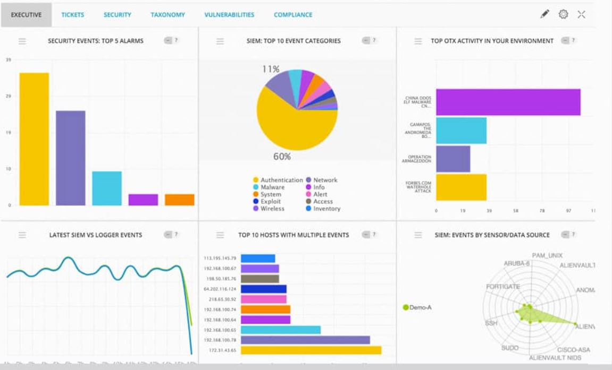
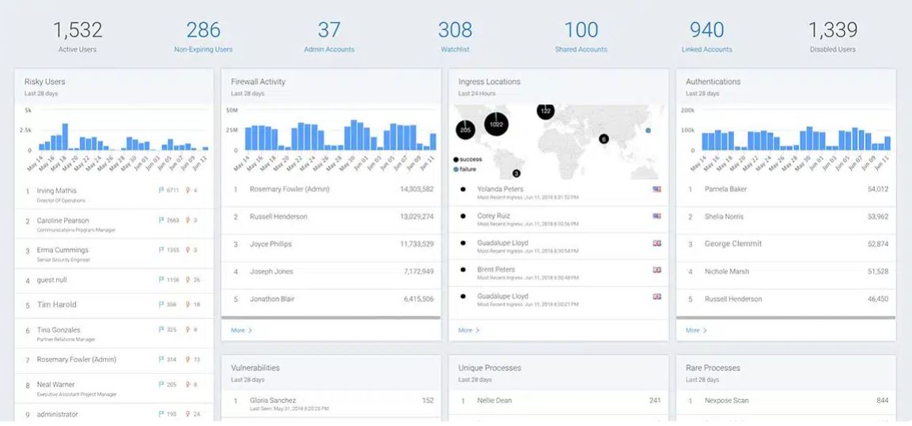
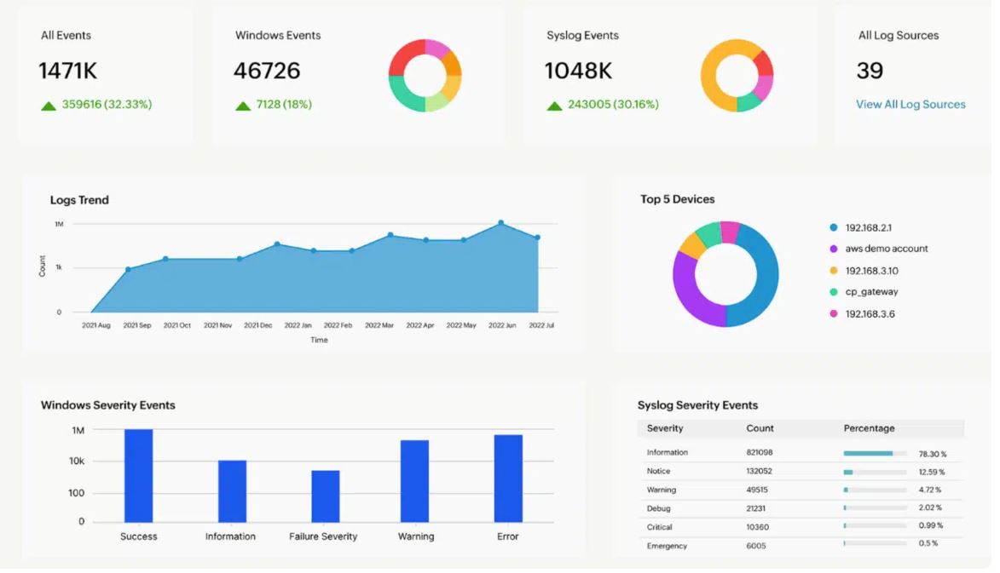

:orphan: (siem-dashboards)=

# SIEM Dashboards: Invaluable Data Sources for Incident Investigations

In the constantly shifting and complex realm of cybersecurity,
maintaining a proactive stance in safeguarding digital assets is of
utmost importance. Security Information and Event Management (SIEM)
systems, equipped with their dynamic dashboards and intricate sensors,
emerge as linchpins in fortifying an organization\'s defence posture.
This article delves deep into the multifaceted realm of SIEM dashboards,
in conjunction with the indispensable sensors, to clarify their pivotal
role as invaluable data sources that underpin the investigative process
during security incidents. The exploration encompasses a thorough
examination of sensitivity settings, trend analysis capabilities, alert
mechanisms, and the intricate art of data correlation, all of which
collectively empower organizations to bolster their cybersecurity
defenses and stay ahead of emerging threats.

## Understanding SIEM Dashboards

SIEM dashboards serve as the user-friendly visual interface of the SIEM
system, providing both real-time and historical data for comprehensive
threat monitoring and agile response strategies. SIEM tools excel in
their capacity to collect and meticulously organize data from an array
of diverse sources, thereby simplifying the intricate task of
identifying anomalies like network irregularities or looming security
threats. These tools are adept at presenting intricate data,
encompassing metrics such as memory usage and network traffic, tailored
to the specific devices in question. This nuanced approach allows for
multi-tiered monitoring, addressing various aspects of the network with
precision and granularity.

In instances where unforeseen spikes or unusual events disrupt the norm,
SIEM\'s correlation engine springs into action, diligently working to
identify potential security vulnerabilities or breaches. Whether it\'s a
stealthy data breach or a brazen denial-of-service attack, the SIEM
system\'s correlation capabilities serve as a powerful ally in promptly
pinpointing these security concerns. In essence, SIEM transcends the
complexities of data analysis, serving as an indispensable aid in not
only recognizing but also proactively resolving security challenges that
might manifest across the diverse facets of a network\'s ecosystem.

## The Importance of SIEM Dashboards in Incident Response

SIEM dashboards are the cornerstone of effective incident response. They
are crucial for incident response because they provide real-time
visibility, alert prioritization, data aggregation, correlation,
timeline reconstruction and evidence collection. They streamline the
detection, analysis, and response to incidents, offering the essential
analytical capabilities for organizations to effectively address
security threats, thus minimizing potential damage and strengthening
overall cybersecurity.

Below we embark on an in-depth exploration of the key components that
contribute to the formation of SIEM dashboards, underscoring their
pivotal role as a foundational data source for conducting meticulous
incident investigations.

### SIEM Sensors

SIEM sensors are the data collection mechanisms at the heart of the
system. These sensors are responsible for gathering information from
various network devices, servers, applications, and endpoints. They are
the frontline sentinels that continuously monitor the digital terrain
for signs of trouble.

Following is a detailed description of the role of sensors in SIEM
dashboards:

-   **Data Aggregation:** One of the primary functions of SIEM
    dashboards is data aggregation. SIEM systems collects, normalizes,
    and stores data from various sources across an organization\'s
    network, including logs from servers, firewalls, routers, and
    applications, providing a holistic view of network activities. By
    consolidating this diverse data into one accessible interface, SIEM
    dashboards grant security professionals a powerful tool to monitor
    and analyze network behaviour effectively. This aggregated data is
    invaluable during incident investigations, allowing security teams
    to reconstruct events and identify patterns that might indicate
    security threats.

-   **Data Normalization:** Sensors may perform data normalization,
    ensuring that the collected data is in a standardized format. This
    is important because different devices and systems may generate logs
    in different formats. Normalization makes it easier for the SIEM
    system to process and analyze the data effectively. By doing so, it
    streamlines the subsequent processing and analysis phases within the
    SIEM system. Normalized data is more accessible and interpretable,
    reducing complexities and inconsistencies that might otherwise
    hinder effective data processing and analysis efforts. Data
    normalization ensures that the SIEM system can work with data
    seamlessly, enabling more accurate and efficient threat detection
    and incident investigation processes.

-   **Event Deduplication:** While sensors collect a significant amount
    of data, they may also employ data reduction techniques to minimize
    noise, filtering out redundant or irrelevant data to reduce noise
    and enhance the clarity and efficiency of investigations. This
    feature ensures that incident investigations focus on actionable
    information rather than getting bogged down by redundant alerts or
    logs.

-   **Log Collection:** One of the primary functions of sensors is to
    collect logs. Logs are detailed records of activities, events, and
    transactions that occur within a network. They include information
    about user activities, system events, network traffic,
    authentication attempts, and more. Sensors ensure that these logs
    are collected and transmitted to the SIEM dashboard. The Write Once,
    Read Many (WORM) concept is integral to SIEM dashboards\' log
    management. It ensures that logs and event data are tamper-proof and
    immutable once recorded. This feature is crucial for maintaining a
    reliable record of security events, ensuring their integrity during
    incident investigations and compliance audits. WORM logs provide a
    trustworthy source of information, free from manipulation or
    deletion attempts. This feature is invaluable when verifying the
    timeline of events and maintaining the chain of custody during
    investigations.

-   **Data Integrity and Security:** Sensors are responsible for
    maintaining the integrity and security of the collected data. They
    ensure that logs and events are not tampered with or compromised
    during the collection and transmission process. By diligently
    upholding data integrity and security, sensors ensure that the chain
    of custody remains unbroken and irrefutable, reinforcing the
    reliability and trustworthiness of the collected data in the eyes of
    the law and investigative authorities. This protective function not
    only strengthens the organization\'s cybersecurity posture but also
    bolsters its legal standing when the need for evidence arises.

**Real-World Application: How Sensors and Dashboards Unite**

Imagine a scenario where a SIEM sensor detects an unusual spike in
outbound network traffic from a specific server during non-business
hours. Simultaneously, a SIEM dashboard raises an alert for multiple
failed login attempts on the same server. Individually, these events may
not seem alarming, but their correlation reveals a potential breach.

Further investigation shows that the server in question had been
subjected to a brute force attack, with the spike in traffic indicating
data exfiltration. The SIEM system\'s sensors and dashboards working in
synergy enable the security team to respond promptly, isolate the
affected server, and secure sensitive data.

### Sensitivity: The Crucial Element of Early Detection

One of the cornerstones of effective incident investigations is early
detection. Sensitivity in relation to SIEM dashboards refers to the
system\'s ability to detect and respond to subtle or minor deviations
from normal network or system behaviour. A highly sensitive SIEM
dashboard is finely tuned to identify even the smallest anomalies or
irregularities in the data it collects and analyzes, such as an
irregular spike in traffic, unauthorized access attempts, or suspicious
system behaviour.

Key aspects of sensitivity in SIEM dashboards include:

-   **Alerting on Minor Anomalies:** A sensitive SIEM dashboard is
    configured to generate alerts for events or patterns of behaviour
    that might be indicative of security threats, even if these events
    are not immediately obvious. This allows security teams to
    investigate and address potential issues before they escalate into
    more significant incidents.

-   **Fine-Tuned Thresholds:** Sensitivity settings often involve
    setting precise thresholds for distinct types of events or data
    points. For example, the dashboard can be configured to trigger an
    alert if CPU usage exceeds a certain percentage, even if it\'s just
    a slight deviation from the norm.

-   **Reducing False Negatives:** A highly sensitive SIEM dashboard aims
    to minimize false negatives, which are cases where actual security
    threats go undetected. By being more attuned to subtle anomalies, it
    helps ensure that potential threats are not overlooked.

-   **Proactive Threat Detection:** Sensitivity is a crucial factor in
    proactive threat detection. It enables security teams to identify
    and respond to security issues at an early stage, which can be
    essential for preventing or mitigating security incidents.

Sensitivity in SIEM dashboards means the system\'s capability to detect
and respond to minor or nuanced deviations from expected behaviour,
allowing organizations to enhance their cybersecurity posture by
identifying potential threats early on. The key lies in their ability to
capture these deviations from the norm, which might otherwise go
unnoticed. This heightened sensitivity is invaluable in detecting
potential threats before they escalate into full-blown security
incidents.

### Trends: Charting the Course of Threats

SIEM dashboards, in conjunction with sensors, provide an avenue for
analyzing trends in network activities. They offer historical context by
maintaining logs of past events. By scrutinizing these trends, security
professionals can uncover patterns that may indicate ongoing threats or
emerging vulnerabilities. For example, a gradual increase in login
failures might not raise immediate alarms, but when viewed over a
period, it can signify a brute force attack in progress. SIEM sensors
capture these trends, allowing security teams to take proactive measures
before an incident escalates.

SIEM dashboards analyze trends in network activities by leveraging the
data collected from various sources, and they do so through several key
steps:

-   **Historical Log Retention:** SIEM dashboards maintain historical
    logs of past events and activities. These logs serve as a valuable
    resource for trend analysis. By retaining this historical data,
    organizations can examine patterns and activities over time.

-   **Pattern Recognition:** SIEM dashboards employ sophisticated
    algorithms and pattern recognition techniques to identify trends
    within the data. They analyze factors such as login attempts,
    network traffic patterns, system resource utilization, and user
    behaviours. The system looks for anomalies or deviations from
    established baselines.

-   **Visual Representation:** SIEM dashboards often present trend
    analysis results in a visually accessible format, such as charts,
    graphs, or timelines. These visual representations make it easier
    for security teams to comprehend and act upon the trends.

-   **Human Interpretation:** While SIEM systems can automatically
    detect and alert on trends, human interpretation remains critical.
    Security professionals review the trend analysis results, assess
    their significance, and determine whether further investigation or
    action is necessary.

-   **Proactive Measures:** Based on the identified trends, security
    teams can take proactive measures to address potential threats or
    vulnerabilities. For example, if a trend suggests a gradual increase
    in login failures, it might prompt a review of password policies,
    the implementation of account lockout mechanisms, or an
    investigation into potential unauthorized access attempts.

SIEM dashboards analyze trends by collecting, normalizing, aggregating,
and retaining data from various sources, applying pattern recognition
algorithms to identify anomalies, and alerting security professionals to
deviations from the norm. This analysis enables organizations to
proactively address emerging threats and vulnerabilities within their
network environments.

### Alerts: Timely Warnings of Trouble 

SIEM dashboards are equipped with automated alerting and trigger
mechanisms, which serve as an early warning system for incident
investigations. These features enable real-time notification of
suspicious activities or deviations from established security norms.
They allow security teams to react promptly to potential threats,
minimizing the damage and reducing response time. Timely alerts can be
the difference between a minor security incident and a catastrophic
breach. Alerts can encompass a range of scenarios, from detecting a
potentially compromised user account to uncovering unauthorized changes
in system configurations.

Following is a detailed description of SIEM dashboard automated
alerting:

-   **Early Detection:** Automated alerting ensures that security teams
    are promptly notified when suspicious or anomalous activities occur
    within the network. This early detection is essential for
    identifying potential security incidents before they escalate into
    more significant threats. By analyzing incoming data in real-time,
    these dashboards can identify unusual patterns or behaviours that
    might indicate a security threat. For instance, a sudden spike in
    network traffic or multiple failed login attempts can trigger
    alerts.

-   **Prioritization:** SIEM systems categorize alerts based on severity
    levels, helping incident responders prioritize their efforts.
    Critical alerts that indicate possible breaches or high-impact
    incidents are addressed with the utmost urgency, while
    lower-priority alerts can be investigated as time permits.

-   **Alert Correlation:** SIEM dashboards often include alert
    correlation capabilities. This means that alerts from multiple
    sources or related alerts are correlated to form a more
    comprehensive picture of the incident. For example, alerts from a
    firewall, intrusion detection system (IDS), and endpoint protection
    may be correlated to reveal a coordinated attack. This correlation
    helps incident responders understand the broader context of an
    incident.

-   **Contextual Information:** Automated alerts provide detailed
    context about the detected event, including the time of occurrence,
    source IP address, affected system, and the nature of the event.
    This information is invaluable during an incident investigation, as
    it helps responders quickly assess the situation and make informed
    decisions.

-   **Automated Responses:** In some cases, SIEM systems can trigger
    automated responses based on alerts. For example, if an alert
    indicates a malware infection on a specific endpoint, the SIEM
    system can automatically isolate that endpoint from the network to
    prevent further spread. Automated responses reduce response times
    and mitigate the impact of incidents.

-   **Integration with Incident Response Workflows:** SIEM systems often
    integrate with incident response platforms and workflows. When an
    alert is generated, it can be automatically incorporated into the
    incident response process. This streamlines the handling of
    incidents, ensuring that they are properly documented and managed.

-   **Historical Data Access:** SIEM dashboards retain historical logs
    and alerts, allowing incident investigators to access past alerts
    related to the incident under investigation. This historical
    perspective helps in understanding the timeline of events,
    identifying the root cause, and assessing the extent of the
    incident.

-   **Compliance and Reporting:** Automated alerts are valuable for
    compliance purposes. They provide documented evidence of security
    incidents, which is essential for compliance reporting and audits.
    SIEM systems can generate reports that include details about alerts,
    their resolutions, and response times, ensuring compliance with
    regulatory requirements.

-   **Incident Documentation:** Alerts generated by SIEM dashboards
    serve as an integral part of incident documentation. They create a
    record of the initial detection of the incident and its subsequent
    handling. This documentation is essential for post-incident
    analysis, lessons learned, and, if necessary, legal proceedings.

SIEM dashboard automated alerting is a proactive and efficient mechanism
for identifying, prioritizing, and responding to security incidents. It
forms the foundation of incident investigations by providing incident
responders with timely and actionable information, helping them contain
and mitigate threats while also documenting incidents for compliance and
future reference.

### Correlation: Piecing Together the Puzzle

Perhaps the most potent capability of SIEM systems is data correlation.
SIEM dashboards and sensors work in tandem to analyze data from multiple
sources, both in real-time and historically, to identify complex attack
patterns that may evade detection when viewed in isolation. Data
correlation is a crucial aspect of incident investigations, as it helps
incident responders connect the dots, identify patterns, and gain a
comprehensive understanding of security incidents. Here\'s how data
correlation functions within SIEM dashboards during incident
investigations:

-   **Alert Correlation:** SIEM dashboards receive alerts and events
    from various sources across the network, including firewalls,
    intrusion detection systems (IDS), antivirus software, and more.
    Data correlation within the SIEM system involves analyzing these
    alerts to identify relationships or dependencies between them. For
    example, multiple alerts related to a specific IP address might
    suggest a coordinated attack. Correlation rules are predefined based
    on security policies and known attack patterns. When a set of alerts
    matches these rules, the SIEM dashboard can generate a correlated
    alert, indicating a potential security incident that warrants
    investigation.

-   **Event Sequencing:** Data correlation also involves sequencing
    events in chronological order to reconstruct the timeline of an
    incident. This helps incident responders understand how an incident
    unfolded over time. For example, SIEM dashboards can correlate login
    events, network traffic logs, and file access records to create a
    timeline showing how an unauthorized user gained access to a system,
    moved laterally through the network, and exfiltrated sensitive data.

-   **Contextual Information:** Data correlation enriches alerts with
    additional contextual information, making it easier for incident
    responders to assess the significance of an alert. This context
    includes details such as the affected system, the user or IP address
    involved, and the nature of the event. Contextual information helps
    incident responders determine whether correlated alerts are part of
    a broader incident or simply isolated events.

-   **Cross-Device and Cross-Application Correlation:** SIEM dashboards
    excel in correlating data across different devices and applications.
    For example, they can connect alerts from a firewall with alerts
    from an email gateway to identify a potential phishing attack that
    originated externally and progressed into the internal network. This
    cross-device and cross-application correlation enhances the
    understanding of the attack vector and the potential impact on the
    organization.

-   **Identifying False Positives:** While data correlation helps
    identify genuine security incidents, it is also valuable for
    recognizing false positives. By comparing multiple alerts and
    events, SIEM dashboards can discern patterns that suggest a false
    alarm, reducing the likelihood of unnecessary incident
    investigations.

-   **Reduction of Alert Fatigue:** By correlating related alerts into a
    single correlated alert, SIEM dashboards reduce alert fatigue.
    Security teams are presented with a manageable number of
    high-priority alerts, enabling them to focus on the most critical
    incidents rather than sifting through numerous individual alerts.

Data correlation by SIEM dashboards is a sophisticated process that
enhances the efficiency and effectiveness of incident investigations. It
helps incident responders connect disparate pieces of information,
uncover hidden threats, and gain a holistic view of security incidents,
ultimately leading to more informed decision-making and quicker incident
resolution.

## Customized Views for Effective Investigations

SIEM dashboards are highly customizable, enabling security teams to
tailor the interface to their specific needs. This flexibility is
particularly advantageous during incident investigations. Security
professionals can create custom dashboards that focus on the most
relevant data points and provide a clear view of the incident under
investigation. Here, we present a selection of sample dashboards to
demonstrate the extent of customization available.

# Final Words

SIEM dashboards, bolstered by the intricate sensors, heightened
sensitivity, automated alerts, trend analysis, and sophisticated data
correlation capabilities, stand as a linchpin in modern incident
investigations. These powerful tools offer security professionals a
panoramic view of network activities, enabling them to detect even the
subtlest anomalies and respond swiftly to evolving threats. The
combination of real-time alerts, historical trend analysis, and
correlation of diverse data sources empowers incident responders to not
only mitigate ongoing threats but also proactively strengthen an
organization\'s security posture. As cybersecurity landscapes
continually evolve, SIEM dashboards, with their multifaceted data
sources, remain indispensable allies in the ongoing battle to safeguard
digital assets and maintain the integrity of systems and data.