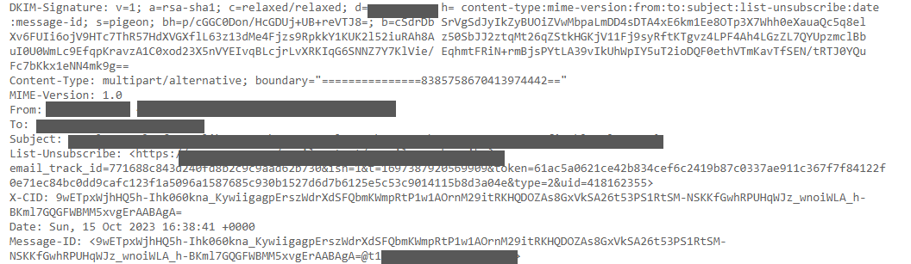

:orphan:
(examining-metadata)=

# Examining Metadata

In the ever-expanding digital landscape, where information is constantly created, accessed, and shared, the significance of metadata in digital forensics investigations cannot be overstated. Metadata serves as an important tool, encapsulating crucial details regarding digital interactions. This invisible layer of information accompanies every file, document, and online activity, offering a treasure trove of insights to investigators. This article discusses metadata, exploring its multifaceted role in digital forensics investigations. We will also discuss the diverse sources of metadata, ranging from email and document files to internet activities, and how they can be examined to gather useful information.

## What is Metadata?

Metadata can be best described as the contextual information that provides insights into other data. Essentially, it is data about data, offering details that describe the characteristics, origins, usage, and structure of a particular piece of information. There are various examples of metadata in different digital contexts. For instance, in the world of documents, metadata includes details like the document's title, author, creation date, and modifications history. In multimedia files such as photos and videos, metadata comprises information about the camera settings, the location where the media was captured, and timestamps. In the realm of websites, metadata includes elements like page titles, descriptions, and keywords, crucial for search engine optimization. Emails contain metadata, indicating sender and recipient details, timestamps, and routing information. 

## The Importance of Metadata

The importance of metadata lies in its ability to provide crucial information about digital artifacts, allowing investigators to understand the 'who, what, when, and how' of a particular event or action. By analyzing metadata, investigators can establish timelines of digital activities, track user behavior, and verify the authenticity of digital evidence. Metadata enables the reconstruction of events, helping investigators piece together the sequence of actions taken on a digital device or network. This forensic analysis is essential in various scenarios, including criminal investigations, cybersecurity incidents, and legal proceedings. Moreover, metadata often contains hidden clues, such as IP addresses, geolocation data, and timestamps, which can be instrumental in tracing hackers, verifying alibis, or confirming the validity of digital documents.

## Differences Sources of Metadata

### Email Metadata

Email possesses a dual nature in the world of digital communication, serving as a fundamental component of electronic correspondence. On one hand, it constitutes the structural framework that facilitates the delivery and organization of email messages. This metadata resides within the email header and encompasses a plethora of crucial details, including sender and recipient addresses, timestamps marking the moment of dispatch and receipt, subject lines, and routing information. It is this metadata that enables emails to navigate the complex web of digital infrastructure, including interactions with mail user agents (MUAs), mail transfer agents (MTAs), and mail delivery agents (MDAs), each playing a specific role in the email's journey. Email also contains the message itself, consisting of the actual content intended for the recipient, forming the other half of this dual nature. Take a look at the following figure to see the information typically present in an email's header :

Here are the details of some common email header information components:

**From:** Indicates the sender's information, though it can be manipulated or forged.

**To:** Specifies the recipient's email address or endpoint, which might not be the final recipient.

**Subject:** Represents the topic or title of the email as set by the sender.

**Date:** Shows the date and time when the email was composed.

**Return-Path:** Also known as Reply-To, it contains the address where replies to the email are directed.

**Delivery Date:** Timestamp indicating when the email was received by the recipient's email client.

**Received:** Lists the servers the email passed through, read from bottom to top, providing the email's route.

**DKIM Signature and Domain Key Signature:** Components of an email signature system (DKIM) that verify the email's authenticity.

**Message-ID:** A unique alphanumeric code assigned to the email when it was created, though it can be forged.

**MIME-Version:** Specifies the MIME (Multipurpose Internet Mail Extensions) version used in the email, enabling attachments in various formats.

**Content-Type:** Indicates whether the email is plaintext or HTML and defines how the email content should be displayed.

**X-Spam Status and X-Spam Level:** Provides information about the email's spam score, with the X-Spam level represented by asterisks.

**Message Body:** Contains the actual content of the email message.

### Mobile Metadata

Mobile devices generate a vast array of metadata, capturing intricate details about users' interactions and activities. This metadata encompasses information such as call logs, text messages, GPS coordinates, Wi-Fi connections, app usage patterns, and much more. Crucially, it provides timestamps for each event, indicating when specific actions occurred. In digital investigations, this metadata acts as a digital footprint, offering forensic analysts invaluable insights into a user's behavior. For instance, call logs and text message metadata reveal communication patterns, highlighting connections between individuals and potentially uncovering illicit activities. GPS data can pinpoint a device's location at specific times, providing a chronological record of movements. Moreover, metadata related to app usage can divulge preferences, interests, and potentially sensitive information. Even seemingly insignificant metadata, when analyzed collectively and in context, can reveal a comprehensive picture of a user's digital life.

### Web Metadata

Web metadata holds paramount significance in the realm of digital investigations, providing investigators with a wealth of information about online activities. When individuals browse the internet, their interactions with websites leave behind a trail of metadata that includes details such as visited URLs, timestamps, and the duration of visits. This information can be pivotal in understanding a user's online behavior, including the websites they accessed, the content they viewed, and the duration of their engagements. In forensic investigations, this data can establish crucial timelines, corroborate or challenge alibis, and unveil patterns of activity. For instance, examining web metadata can help determine if a suspect accessed specific online materials, interacted with certain platforms, or communicated with particular individuals through web-based applications. Furthermore, it can assist in tracking the origins of cyber threats, identifying malicious websites, and understanding the pathways through which malware or phishing attacks are disseminated. The metadata trail left by web browsing activities not only aids in solving cyber crimes but also plays a pivotal role in verifying digital evidence and ensuring the integrity of investigations in legal proceedings.

One of the key strengths of web metadata in digital investigations lies in its ability to uncover hidden or deleted online activities. Even if a user attempts to erase their browsing history or delete specific files, traces of their online interactions often persist in the form of metadata. Digital forensics experts can meticulously analyze this metadata to reconstruct the user's online journey accurately. Moreover, web metadata is instrumental in identifying potential connections between different online accounts or individuals. By cross-referencing web activity with other forms of digital evidence, investigators can build comprehensive profiles of suspects or victims, shedding light on their online relationships, interests, and affiliations. 

### File Metadata

File metadata, a fundamental aspect of digital information, comprises two primary categories: system metadata and application metadata. System metadata is used by the file system to manage files effectively. It includes essential details such as the filename, timestamps indicating the last access, creation, and modification, as well as ownership information, parent object references, permissions, and security descriptors. System metadata is vital for the operating system to organize and maintain files, ensuring efficient data management. 

In contrast, application metadata is specific to the software or application that created or manages the file. For instance, documents created using word processing software contain application metadata like author names, revision history, and timestamps indicating edits. Similarly, image files often store application metadata such as EXIF(Exchangeable image file) data, providing information on the camera settings, GPS coordinates where the photo was taken, and details about the device used. This metadata can be invaluable in forensic investigations. By analyzing system metadata, investigators can establish timelines, track file movements, and determine user interactions with files. Application metadata, especially in multimedia files, can offer insights into the source and authenticity of files, helping investigators confirm the legitimacy of digital evidence. Understanding file metadata is crucial for digital forensics experts, allowing them to trace the origins of files, detect tampering, and establish the integrity of evidence, which is vital in legal proceedings.  

## Conclusion

Metadata acts as a critical reservoir of information, providing essential insights into the digital trails left behind by users. Recognizing the nuances and comprehending the diverse types of information found within each major metadata category is paramount. This understanding equips investigators with the tools needed to decode the intricate details, enabling them to reconstruct events, validate evidence, and ultimately unravel complex cases.
