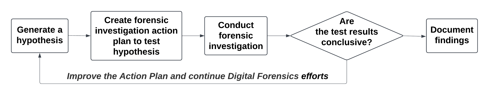
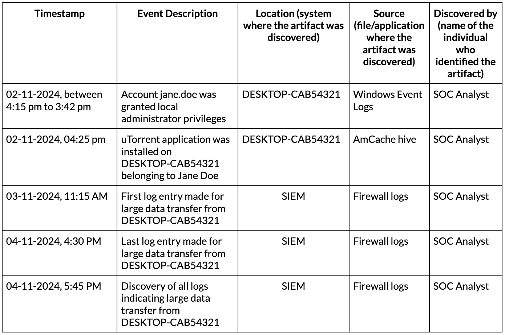

:orphan:
(structured-investigation-process)=

# Structured Investigation Process

When an incident is detected on a network, adopting a structured investigation process is essential to uncover the root cause, mitigate the security issue, and recover from the incident effectively. Root Cause Analysis (RCA) in IT is a systematic process used to identify the underlying cause of a problem, incident, or failure within an IT system or environment. It is valuable for system and network administrators to help trace the root cause of issues related to downtime, connectivity and performance. The goal is to determine the "root cause" rather than just addressing symptoms, ensuring that the problem is resolved permanently and doesn't reappear. RCA can be adapted when a security incident occurs on a network, and a digital forensics investigation must be conducted to recover from it. RCA can guide the implementation of the different activities to thoroughly understand the incident, enabling a structured and effective investigation process.

## Incident Overview

Firewall logs indicate that one machine has downloaded and sent about 15 GB of data. This activity has occurred between 3rd November 2024, 11:15 AM and 4th November 2024, 4:30 PM. Preliminary scan on the machine indicates the presence of an auto-start entry in the registry for *uTorrent*. It is a BitTorrent client application.

The machine DESKTOP-CAB54321 belongs to user *Jane Doe*. She cannot recall having ever installed the *uTorrent* software application.

The goal of handling this incident is to determine what led to the *uTorrent* application being installed on the machine, and what data was involved in the 15 GB transfer, i.e. what data left the network.

## Investigating a Cyber Incident: Key Activities

A cybersecurity investigation is an iterative process.The key activities are listed below:

- Create and Maintain the Incident Statement
- Dimension the Incident
- Generate and Test Hypotheses
- Create and Maintain a Timeline
- Develop, Test and Deploy Response Actions

These activities aren’t meant to be followed step-by-step; instead, focus on understanding the purpose of each action and revisit them as needed until the incident is fully resolved.

Now, let’s take a look at how the structured investigation process would proceed for the incident described above.

## Create and Maintain The Incident Statement

We will begin by creating the Incident Statement. It is a formal statement outlining the confirmed facts that we already know about the incident. The purpose of this step is to help establish clarity and gain perspective on the task at hand. Aim to tabulate answers to the following questions:

- What is the specific thing we have a problem with?
- What are confirmed facts about this incident?

## Dimension the Incident

Next, we will dimension the incident, compiling both technical and non-technical confirmed facts. The aim is to gain a comprehensive understanding and eliminate bias. For the seven dimensions listed below, we’ll document the confirmed facts:

At this stage, we have sufficient understanding of the various incident dimensions. We can return and refer to this information at any time during the investigation.

## Generate and Test Hypotheses

The investigation can proceed to the next step. The forensics team can use the known and confirmed facts about the incident to perform digital forensics on the affected machine, and determine what data has been lost or downloaded into the network. 

We know that the affected machine is running the Windows operating system. There are many forensic artifacts available on a Windows computer. Hypotheses must be generated and tested to guide the forensic investigation process, to help determine the artifacts to acquire and analyze.

We can generate and test as many hypotheses as required until we have the required information about the incident.

A hypothesis is a statement made based on the available information as the starting point for an investigation. To test a hypothesis, we will clearly outline the steps in an ‘Action Plan’. Based on the ‘Action Plan’, a forensic investigation is conducted. Forensic examination and analysis will help determine whether a hypothesis is true or not. Once we have tested all the hypotheses, we will have enough evidence to understand how the incident occurred.

The following table presents four hypotheses and the corresponding action plan to test them:

The table above provides an overview of the forensics investigation action plan for each hypothesis. A detailed action plan, highlighting the list of all tasks to be performed can be maintained in a separate document, with additional information about each task (tools required, assigned personnel, etc.).

Completing an action plan and verifying the results of a hypothesis, i.e., confirming whether a hypothesis is true or not, could take a few days to weeks depending on the volume of data to be analyzed.

As the structured investigation process is an iterative one, you can add more hypotheses to the list and test them until there is sufficient information about the incident.

## Create and Maintain a Timeline

An incident timeline is a record of the sequence of confirmed events that have been attributed to the incident. The following table represents the timeline of the incident involving uTorrent. The events have been presented in chronological order:

As each hypothesis is tested and verified through forensic investigation, the incident statement, dimensions, timeline and the list of hypotheses are updated until enough information is obtained to understand and recover from the incident.

Adopting a structured investigation process helps streamline the course of a digital forensic investigation, by providing clear insight into the confirmed facts and the performed activities, and visibility into the investigation results.

## Conclusion

This article discussed how the systematic process of Root Cause Analysis (RCA) can be adapted to conduct a structured digital forensics investigation. By performing activities such as creating the incident statement, dimensioning the incident, generating and testing hypotheses, maintaining an incident timeline and deploying incident response actions iteratively, it is possible to uncover the root cause of the security issue and effectively recover from it. A structured investigation process provides incident response teams with a structured framework to not only uncover the root cause of an issue but also ensure long-term prevention and recovery.
