:orphan:
(openvas-labsetup)=

# OpenVAS

This article outlines the steps to set up the Open Vulnerability Assessment Scanner, also known as OpenVAS, on a Kali virtual machine.

## Tools/Skills Required

- Kali Virtual Machine (You can use the prebuilt Kali images available)
- Ability to use the command-line terminal in Kali

## Steps to install OpenVAS on Kali

Begin by updating and upgrading the package repository on Kali using the following command:

`sudo apt update && sudo apt upgrade`

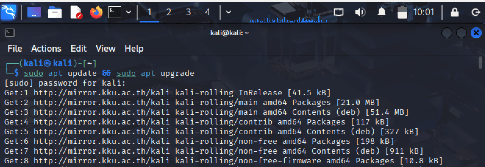

Then, download the package for OpenVAS using the following command:

`sudo apt install gvm -y`

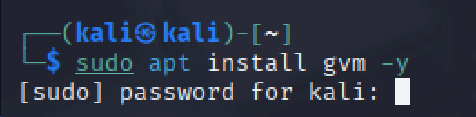

Next, use the following command to install and setup OpenVAS:

`sudo gvm-setup`

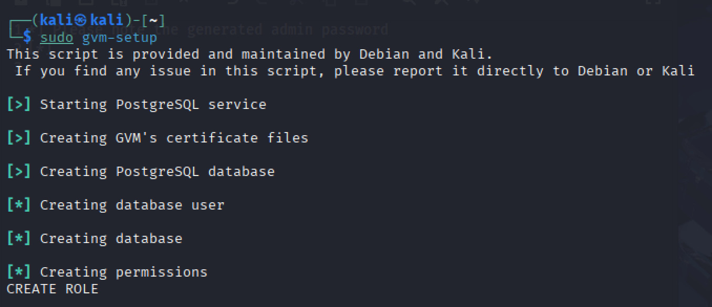

You will be shown the password for the *admin* user. Ensure to make a note of this password:

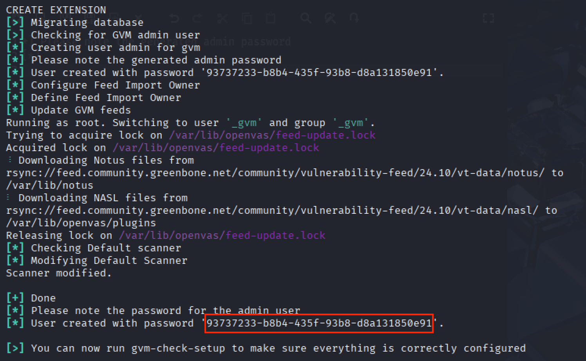

If you encounter any errors at this point, navigate to the *Troubleshooting* section at the end of this article.

Issue the following command to validate the success of the setup process:

`sudo gvm check-setup`

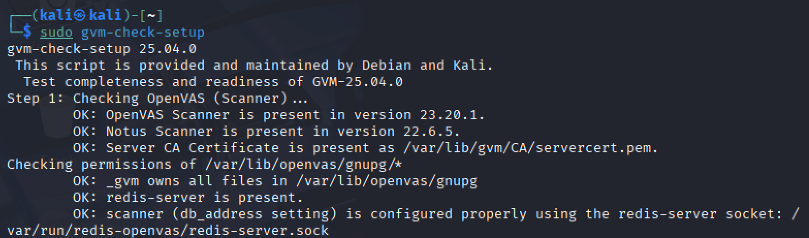

If the installation has progressed as expected, you will be shown a message that the GVM installation is OK, as shown in the following screenshot:

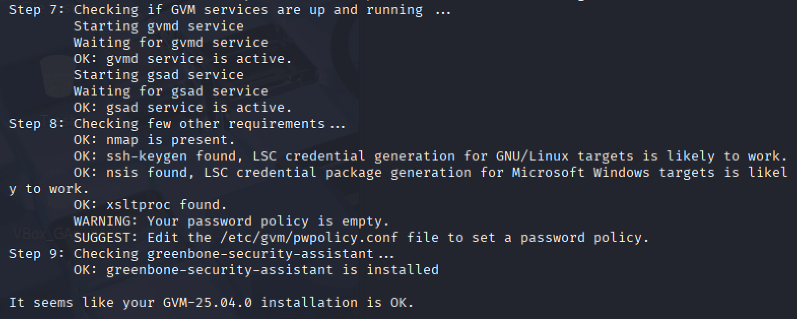

Issue the following command to download the latest community feeds:

`sudo greenbone-feed-sync`

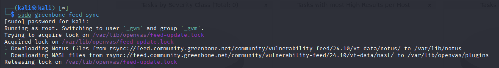

Once the feeds have been downloaded, issue the following command to start OpenVAS:

`sudo gvm-start`

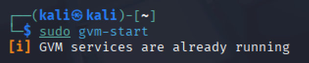

You will be shown the login page. Provide the credentials for the *admin* user. Here, use the password displayed to you during the setup process:

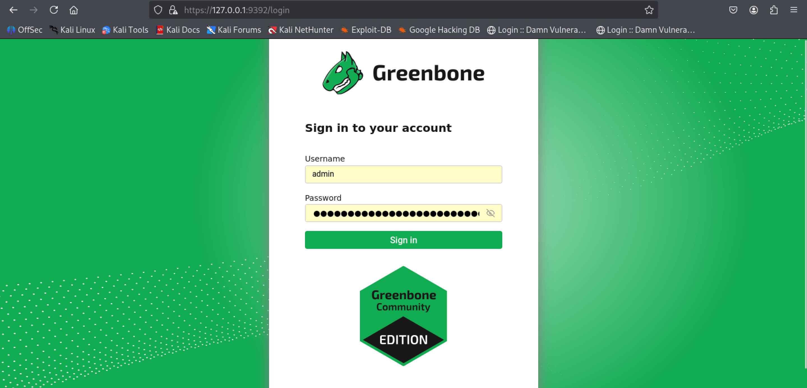

After logging in, you will see a message that the feeds are being synced:

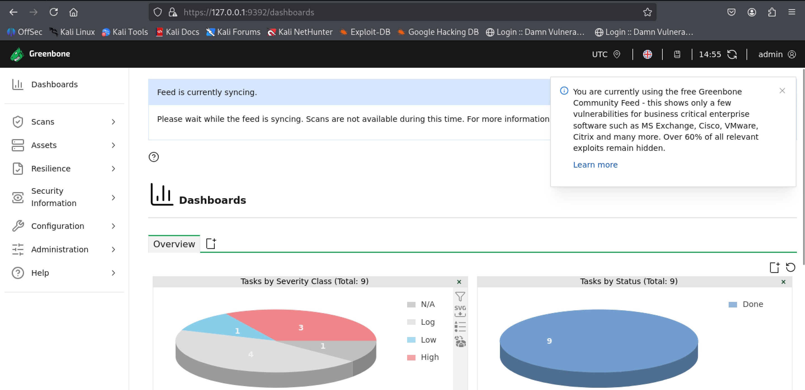

Navigate, to the *Administration* | *Feed Status* section to view the current status of the feeds:

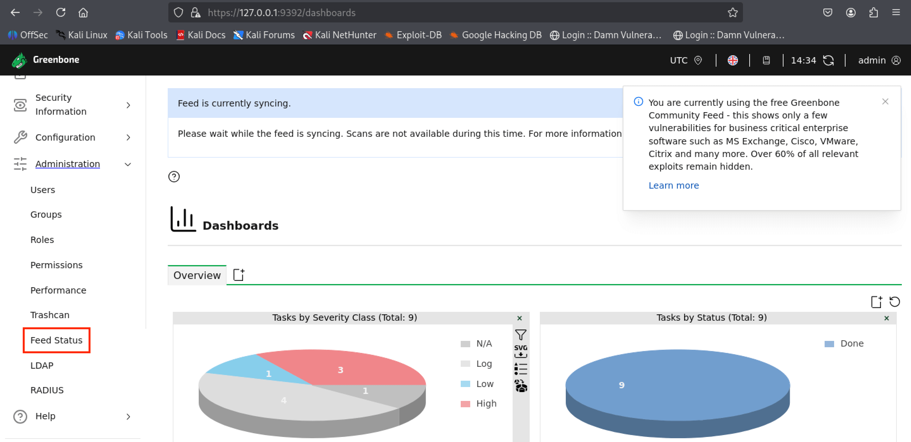

The feed will be updated. This process may take a few minutes to a few hours to complete:

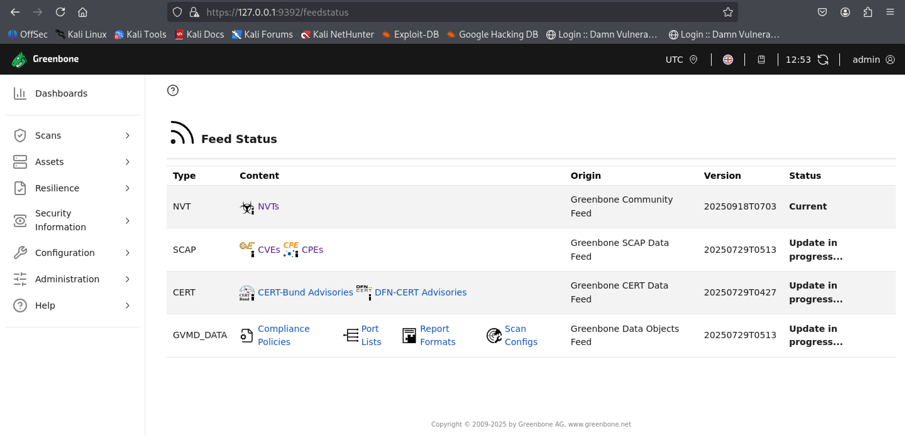

Once the status for all the feeds is marked as *Current*, as shown below, OpenVAS is ready to use for vulnerability assessments.

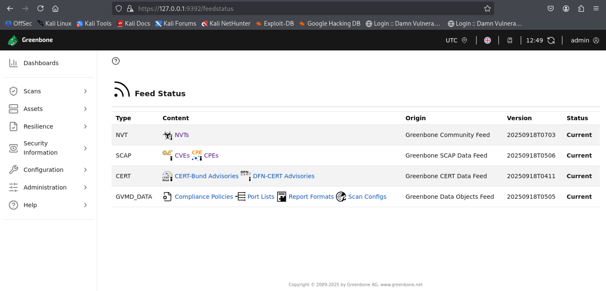

## Troubleshooting

You may encounter errors as shown below during the installation of OpenVAS:

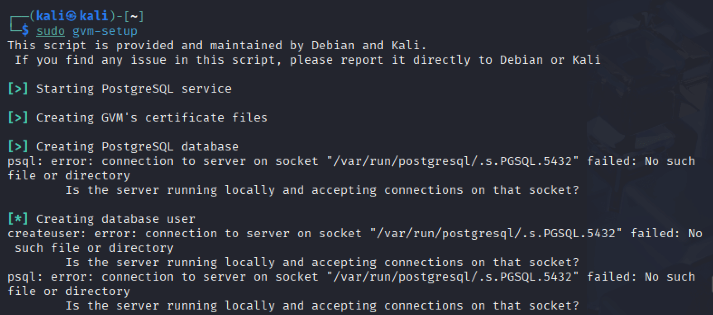

In this case, issue the following command to view the status of PostgreSQL clusters used by OpenVAS:

`sudo pg_lsclusters`

If the result is displayed in red, it means the cluster is currently unavailable. In this case, note the value in the *Ver* column. It is 17 in the following screenshot:

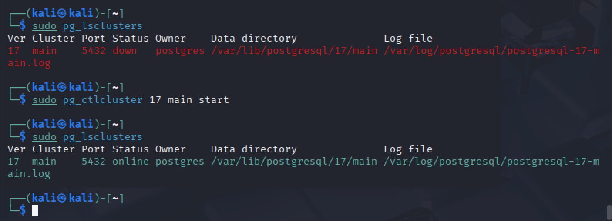

Then, issue the following command to make the PostgreSQL cluster available:

`sudo pg_ctlcluster 17 main start`

Ensure to provide the cluster version number that matches your setup.

Once this process completes, view the status of the PostgreSQL cluster again. If the result is displayed in green, it means the cluster is now online and available. 

You can proceed with the OpenVAS setup.

