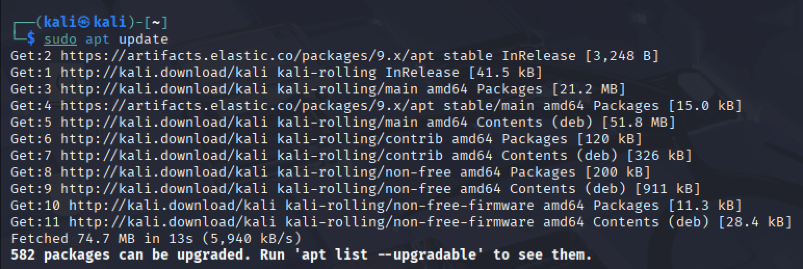
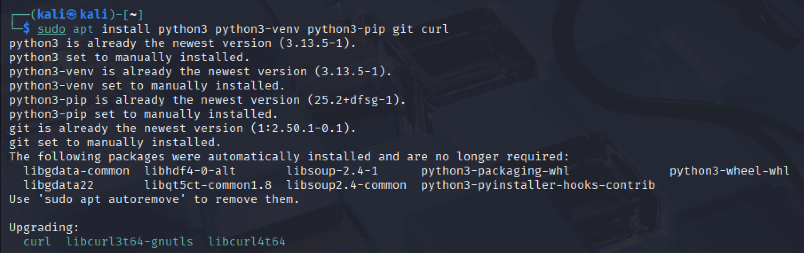
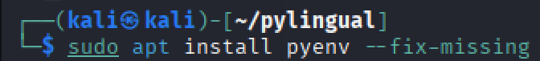
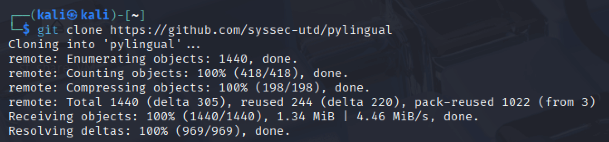
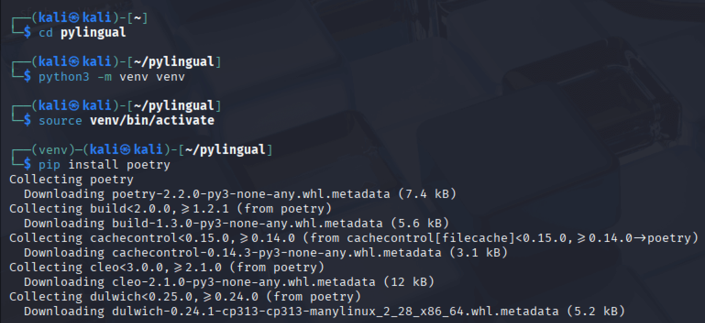
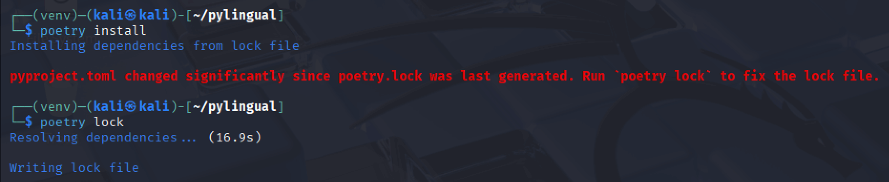
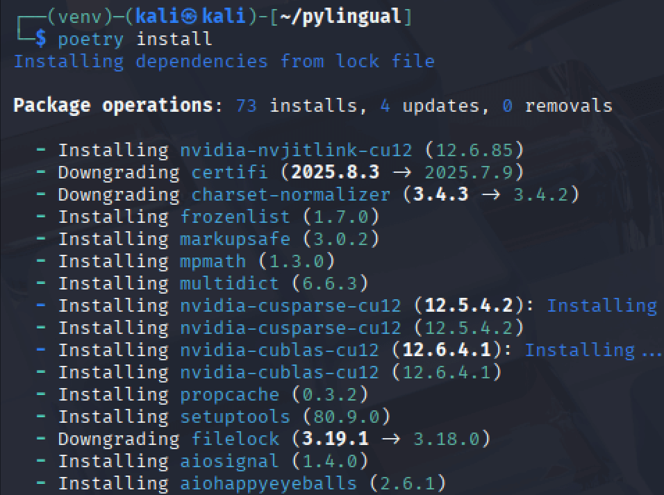
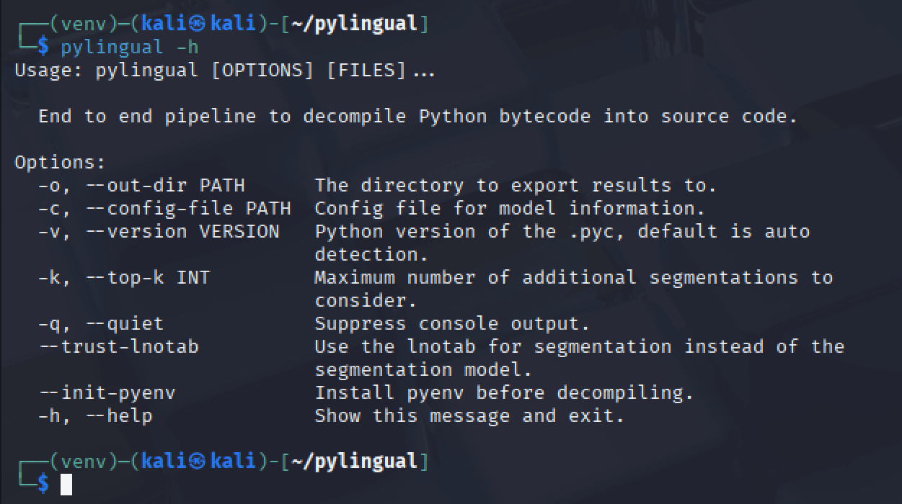

:orphan:
(pylingual)=

# Pylingual Python Decompiler

This article outlines the steps to set up the Pylingual python decompiler on a Kali VM to decompile python executables.

## Tools/Skills Required

- Kali Virtual Machine (You can use the prebuilt Kali images available)
- Ability to use the command-line terminal in Kali

## Steps to install Pylingual Decompiler on Kali

Begin by updating the existing package repository, using the following command:

`sudo apt update`

Next, install the required packages using the following command:

`sudo apt install python3 python3-venv python3-pip git curl`

Another package *pyenv* is required, that can be installed using the package manager:

`sudo apt install pyenv --fix-missing`

During the installation process, if the retrieval of a package fails, you can instruct the package manager to fetch the requirements at a later stage using *--fix-missing*.

Then, clone the *pylingual* repository hosted on Github to your Kali VM:

`git clone https://github.com/syssec-utd/pylingual.git`

Navigate into the *pylingual* directory:

`cd pylingual`

Then, create the python virtual environment:
`python -m venv venv`

Then, activate the python virtual environment:
`source venv/bin/activate`

Notice how the terminal prompt changes. Then, install poetry to manage packages in the virtual environment:

`pip install poetry`

The next step is to install the other required packages using the `poetry install` command. If there are errors, use the `poetry lock` command as shown below:

Then, install the other required packages:

Once this process is complete, *pylingual* will be installed in the python virtual environment and you will be able to view its help menu:

`pylingual -h`

Everytime you intend to use *pylingual*, you must navigate into the directory where its code is present using `cd pylingual` and activate the python virtual environment using `source venv/bin/activate`. Then you will be able to use *pylingual* to decompile code written using python.